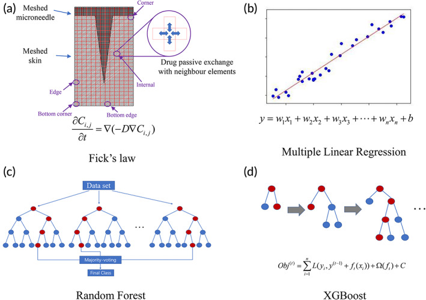
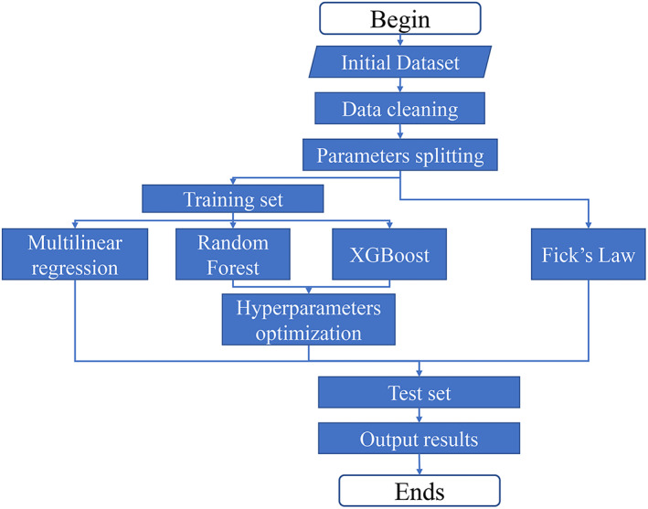
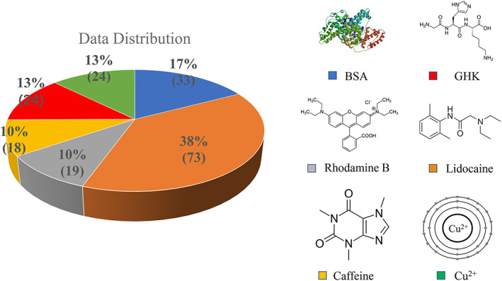
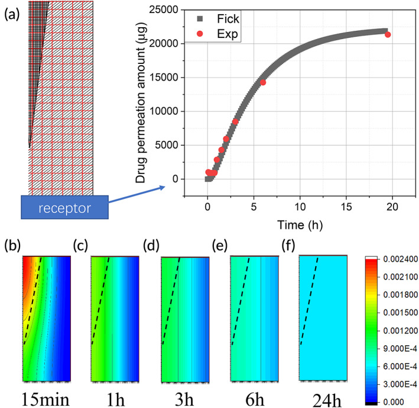
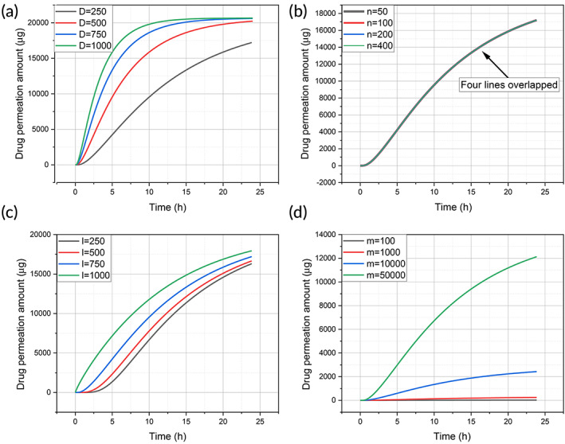
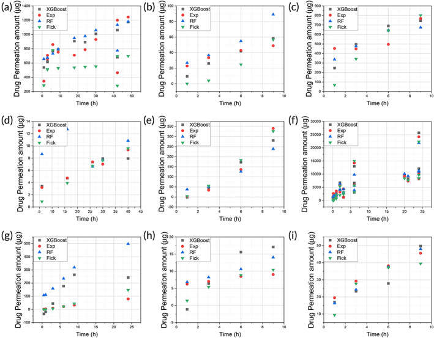
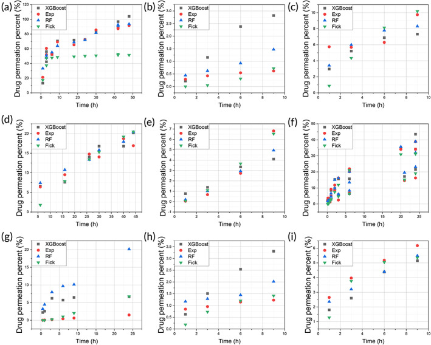
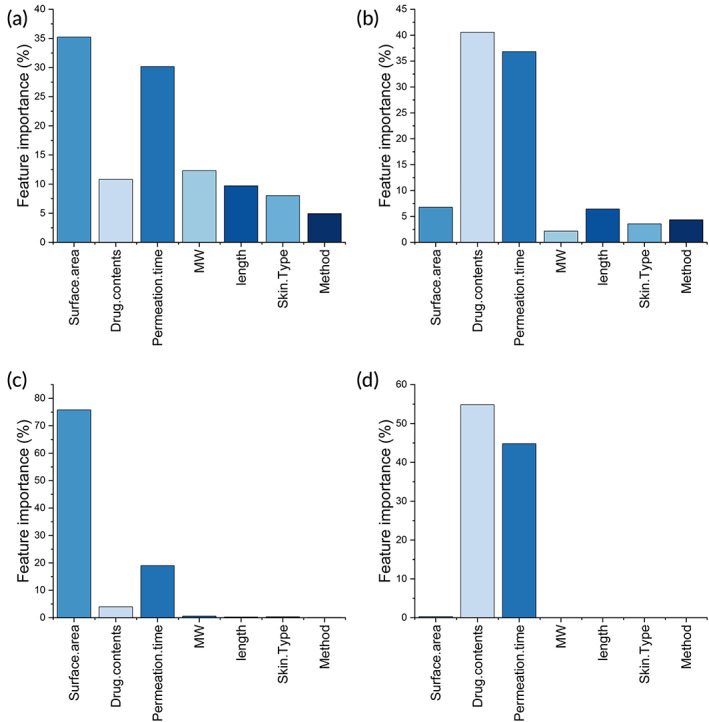

:::::::: {.paper-page .page-1 .front-page}
::::::: {.page-content}

受領: 2022年11月11日　　改訂: 2023年2月22日　　採択: 2023年3月8日

DOI: 10.1002/btm2.10512

研究論文

<h1 class="article-title">機械学習によるマイクロニードル処理皮膚を介した薬物透過の予測</h1>

Yunong Yuan1　|　Yiting Han2,3　|　Chun Wei Yap4　|　Jaspreet S. Kochhar5　|　Hairui Li6　|　Xiaoqiang Xiang2　|　Lifeng Kang1

1 シドニー大学 医学・健康学部 薬学部（オーストラリア、ニューサウスウェールズ州2006） 
2 復旦大学 薬学院 臨床薬学・薬事管理学科（中国、上海201203） 
3 ハーバードT.H.チャン公衆衛生大学院（677 Huntington Avenue、米国、マサチューセッツ州ボストン02115） 
4 ナショナル・ヘルスケア・グループ（1 Fusionopolis Link、シンガポール138542） 
5 プロクター・アンド・ギャンブル（70 Biopolis Street、シンガポール138547） 
6 MGIテック（21 Biopolis Road, Nucleos、シンガポール138567）

:::::: {.columns-grid .front-summary}
::::: {.column .column-left}
### 連絡先

Xiaoqiang Xiang（復旦大学 薬学院 臨床薬学・薬事管理学科、中国、上海201203）  
メール: xiangxq@fudan.edu.cn

Lifeng Kang（シドニー大学 医学・健康学部 薬学部、オーストラリア、ニューサウスウェールズ州2006）  
メール: lifeng.kang@sydney.edu.au

### 研究資金

中国国家留学基金管理委員会（助成番号: 202008320366）；シドニー大学（助成番号: PCA2019）
:::::

::::: {.column .column-right}
## 要旨

角質層は、外来物質の人体内への侵入を防ぐ皮膚の最外層である。マイクロニードル（MN）は長さ数百μmの鋭い突起であり、角質層を貫通して皮膚を介した薬物透過を促進できる。皮膚を介して送達される薬物量の測定には、通常 in vitro 薬物透過試験が用いられるが、この試験には費用と時間を要する。この問題に対処するため、本研究では皮膚透過実験を実施せずに皮膚を介した薬物透過を予測する機械学習手法を用いた。実験データとシミュレーション結果を比較したところ、4種類のシミュレーション手法のうち eXtreme Gradient Boosting（XGBoost）が最良であった。また、薬物搭載量、透過時間、および MN 表面積がモデルの重要なパラメータであることが明らかとなった。結論として、機械学習は MN 支援経皮薬物送達における薬物透過プロファイルの予測に有用である。

### キーワード

機械学習、マイクロニードル、重回帰、ランダムフォレスト、経皮、XGBoost
:::::
::::::

:::::: {.columns-grid .front-introduction}
::::: {.column .column-left}
## 1. はじめに

マイクロニードル（MN）パッチは、金属やポリマーなどの生体適合性材料から作製された、長さ数百μmの MN のアレイで構成される。1 MN は、外来物質の人体内への侵入を防ぐ強固な生物学的障壁である皮膚に複数のμmサイズの経路を形成することで、皮膚内および/または全身循環への薬物透過を促進できる。2-5 MN の概念が単純で、製造技術上も実現可能であることから、MN は低分子化合物、6,7 ペプチド、8-10 mRNA、11 タンパク質、12 細胞外小胞13など、多様な治療用物質を人体へ送達するデバイスとして広く研究されてきた。
:::::

::::: {.column .column-right}
皮膚を介して人体内へ移行する薬物量は、in vitro 皮膚透過試験によって測定できる。この試験では、MN パッチを動物またはヒトの摘出皮膚に装着し、Franz 型拡散装置に設置して、複数の時点で薬物濃度を測定する。14 これにより、皮膚を透過した薬物量の経時変化が得られ、薬物用量と治療効果の観点から MN パッチの性能を評価できる。しかし、このような試験には費用と時間を要する。15
:::::
::::::

本論文は Creative Commons Attribution License（CC BY）の条件に基づくオープンアクセス論文である。適切に原著を引用する限り、媒体を問わず利用・配布・複製できる。© 2023 The Authors. Bioengineering &amp; Translational Medicine, Wiley Periodicals LLC.

:::::::

Bioeng Transl Med. 2023;8:e10512.wileyonlinelibrary.com/journal/btm21 / 15

::::::::

:::::::: {.paper-page .page-2}

2 / 15BIOENGINEERING &amp; TRANSLATIONAL MEDICINEYUAN ET AL.

::::::: {.page-content}
:::::: {.columns-grid .dense}
::::: {.column .column-left}
この問題に対処するため、in vitro 皮膚透過実験の代わりに、予測変数から薬物透過プロファイルを推定するシミュレーション手法が検討されてきた。著者らは以前、局所製剤に用いる賦形剤の物理化学的特性と薬物透過速度を関連付ける重回帰（MLR）モデルを構築した。16 このモデルによる予測値は実験結果によく適合した。MLR モデルを用いれば、入手困難なヒト皮膚試料による in vitro 実験を行わずに、賦形剤、すなわち皮膚透過促進剤の性能を予測できる。

この先行研究を踏まえ、本手法を MN 支援経皮送達へ応用し、in vitro 皮膚透過試験を行わずに送達過程をシミュレートして薬物透過を予測することとした。さらに MLR 以外の機械学習手法も検討した。MN による薬物透過プロファイルは従来の局所製剤より複雑であるため、高度な機械学習モデルは MLR より高精度な予測を示す可能性がある。

機械学習は人工知能の一分野であり、訓練データセットに基づいてモデルを構築し、予測または意思決定を行う。機械学習は、がん診断、抗生物質合成、化学反応の最適化、タンパク質構造予測など、医学のさまざまな領域で研究されている。17-25 薬物送達の分野にも多くの応用がある。例えば、患者の薬物動態パラメータの変化という観点から、潜在的な薬物-薬物相互作用を予測する機械学習モデルが提案されている。26 このモデルは臨床試験前の薬物-薬物相互作用評価に利用でき、創薬および医薬品開発に役立つ可能性がある。

近年、機械学習は MN の設計・製造の最適化にも用いられている。例えば、MN パッチの製造支援に深層学習が用いられた。このモデルにより、実製造に先立って効率的な MN 製造手順を探索でき、材料と資源を節約できる。27 別の研究では、表面侵食理論と Fick の法則を用いてポリマー MN パッチからの薬物拡散をシミュレートした。28 このモデルによって、MN パッチを実際に作製せずに設計を最適化できる。これらの進展を踏まえ、同様のアプローチによって皮膚を介した薬物透過を予測できると仮定した。

本研究では機械学習を用いて MN 支援経皮薬物送達過程をシミュレートし、皮膚を介した薬物透過を予測した。モデルのパラメータには MN の特性と薬物の物理化学的特性を含めた。学習に用いたデータ点は、データの一貫性を確保するため、著者らによる MN 支援経皮薬物送達の既報研究から収集した。一次 MLR、ランダムフォレスト（RF）、eXtreme Gradient Boosting（XGBoost）の3種類の機械学習手法を用い、比較対象として Fick の法則に基づくシミュレーションも含めた。Fick の法則モデルの主要パラメータは学習データセットからではなく、文献から取得した。著者らの知る限り、機械学習によって MN 処理皮膚を介した薬物透過を予測した研究は本報が初めてである。
:::::

::::: {.column .column-right}
## 2. 方法

### 2.1. データ収集

著者らの MN 支援経皮薬物送達に関する既報研究では、カフェイン、銅、ペプチド、ウシ血清アルブミン（BSA）、リドカイン、ローダミンの6種類の薬物・化学物質について、同様のプロトコルと装置を用いて in vitro 皮膚透過実験を行った。実験では Franz 型拡散装置を用い、皮膚を介した薬物透過の経時変化を測定した。これらの研究から得たデータ点を1つのデータベースに統合した。

銅9およびペプチド9のデータは、Li らが取得したプラスチック製 MN に基づく。カフェイン、29 BSA、30およびローダミン31の皮膚透過データは、Neo および Kochhar らが取得したヒドロゲル MN に基づく。リドカインの皮膚透過データは、Kochhar12および Li ら32が取得したプラスチック製 MN とヒドロゲル MN の両方に基づく。全データセットは Data S1 に収録されている。

### 2.2. シミュレーション手法の概要

4種類の手法を図1に示す。Fick の法則では、図1aに示す MN と皮膚の中央断面を表した2次元モデルにより、皮膚を介した薬物透過を予測した。これは、MN を皮膚へ適用する in vitro 皮膚透過試験の典型的な構成である。MN に封入された薬物は皮膚組織へ拡散し、続いてレセプター液へ拡散する。複数時点でレセプター液中の薬物濃度を測定し、皮膚を透過した薬物の累積量を求める。

4手法すべてにおいて、従属変数は皮膚を透過した薬物の累積割合または累積量である。透過時間や MN の特性などの記述子から、この割合または量を予測した。図1bの一次 MLR モデルでは、従属変数と記述子との間に線形相関を仮定する。この線形仮定は必ずしも成立しないが、MLR は予測用の単純なモデルを提供する。RF と XGBoost は、図1c、dに示すように決定木に基づく。

in vitro 皮膚透過試験から収集したデータ点を、学習セットとテストセットへ無作為に分割した。学習セットは機械学習アルゴリズムによるモデル構築に、テストセットは各モデル（MLR、RF、XGBoost）の頑健性と精度の検証に用いた。
:::::
::::::
:::::::

Bioeng Transl Med. 2023;8:e10512.wileyonlinelibrary.com/journal/btm22 / 15

::::::::

:::::::: {.paper-page .page-3}

3 / 15BIOENGINEERING &amp; TRANSLATIONAL MEDICINEYUAN ET AL.

::::::: {.page-content}
:::: {.figure-block .figure-1 .figure-wide}
{.figure-image loading="eager"}

<strong>図 1.</strong> 皮膚を介した薬物透過の予測に用いた4手法。（a）Fick の法則、（b）重回帰、（c）ランダムフォレスト、（d）XGBoost。

::::

:::::: {.columns-grid .below-figure .dense}
::::: {.column .column-left}
### 2.3. Fick の法則

皮膚を介した薬物透過過程では、Franz 型拡散装置のレセプターコンパートメント内の薬物濃度を、式（1）に示す Fick の第2法則によって計算できる。

$$
\frac{\partial C}{\partial t}=D\left(\frac{\partial^2 C}{\partial x^2}+\frac{\partial^2 C}{\partial y^2}\right)
$$

(1)

式（1）において、*C* は時刻 *t* における薬物濃度、*D* は拡散係数である。皮膚透過実験と同様の初期条件および境界条件を与えると、MN を用いない皮膚透過については式（1）の解析解を得ることができる。33,34 しかし、MN を皮膚膜へ挿入すると薬物透過過程は複雑になる。この場合、皮膚内の薬物濃度は皮膚深さだけでなく MN の形状にも依存するため、解析解を求めることは困難であり、必ずしも必要ではない。そこで、微分方程式の解を近似し、領域全体ではなく各部分領域を計算する領域離散化に基づく数値解が有用となる。近年、市販ソフトウェア（COMSOL Multiphysics）を用いた MN 支援皮膚透過の数値解が報告された。35 本研究では C 言語でモデルを記述し、MN 支援薬物透過について式（1）の数値解を得た。
:::::

::::: {.column .column-right}
モデリングを単純化するため、図1aに示す2次元モデルで3次元の MN-皮膚系を表現した。2次元モデルは MN の断面を示し、3次元 MN 内の薬物総量を2次元面上に均一に分布させる。MN パッチは通常、一定間隔で配置された複数の同一 MN からなる。モデリングでは、図1aの各 MN-皮膚ユニットがメッシュ内の他のユニットから独立した反復単位であると仮定した。このため、メッシュ要素は角、下隅、端、下端、内部の5種類に分けられ、それぞれ異なる境界条件をもつ。例えば、内部要素は上下左右の要素と薬物を交換する。一方、端要素は上、下、右の要素とのみ交換し、左側には交換相手となる要素がない。薬物交換量は濃度勾配と拡散係数の積から計算する。

このモデルでは、式（1）の左辺が任意の要素内における薬物濃度の時間変化を、右辺がその要素と隣接要素との薬物交換を表す。Taylor 展開を用いて各要素の薬物濃度を計算することで、式（1）を解くことができる。36 メッシュ化した MN-皮膚系全体について、各要素の薬物濃度を時間ステップごとに更新する。薬物分子が皮膚を徐々に透過してレセプター液へ到達した後、任意の時点におけるレセプター内の薬物量は、レセプター液量とその時点の薬物濃度の積として求められる。さらに、1本の MN から移行した薬物量に1枚の MN パッチ上の MN 総数を乗じ、レセプター液中の総薬物量を得る。
:::::
::::::
:::::::

Bioeng Transl Med. 2023;8:e10512.wileyonlinelibrary.com/journal/btm23 / 15

::::::::

:::::::: {.paper-page .page-4}

4 / 15BIOENGINEERING &amp; TRANSLATIONAL MEDICINEYUAN ET AL.

::::::: {.page-content}
:::::: {.columns-grid .dense}
::::: {.column .column-left}
累積薬物透過量は、拡散装置内のドナーコンパートメントとレセプターコンパートメントの間にある拡散窓1 cm²を通過した薬物量と定義した。著者らの既報の in vitro 皮膚透過実験では、垂直型と水平型の2種類の Franz 拡散装置を用いた。垂直型装置9の拡散面積は1 cm²、水平型装置12では1.13 cm²であった。このため、実験で得た累積薬物量を1 cm²当たりに正規化した。

累積薬物透過率は、式（2）に示すように、時刻0から *t* までの累積透過量（*m*t）を MN 内に含浸させた薬物総量（*m*total）で除して算出する。

$$
\text{透過率}=\frac{m_t}{m_{\mathrm{total}}}\times100\%
$$

(2)

本モデルでは、モデリングを単純化するために5つの仮定を置いた。第1に、MN の形状は非圧縮性である。MN は非分解性で、皮膚への挿入後も圧縮されないものとした。第2に、MN 内の薬物は均一に分布し、各要素内の薬物濃度も均一である。本モデルは2次元であるため、薬物は X 方向と Y 方向にのみ拡散する。第3に、皮膚内の薬物拡散係数は一定とし、皮膚透過試験は通常体温で実施されるため温度の影響を無視した。第4に、透過した薬物は Franz 装置内の皮膚とレセプター液の界面を閉塞しない。レセプターコンパートメントでは常に撹拌を行うため、薬物は皮膚膜を透過すると直ちにレセプター液へ分散する。第5に、すべての実験で皮膚膜の厚さを1 mmと仮定した。MN の長さが数百μmであるのに対して皮膚膜の厚さは約1 mmであるため、この仮定は妥当である。
:::::

::::: {.column .column-right}
### 2.4. 重回帰（MLR）

MLR は、複数の独立変数に基づいて従属変数を推定する回帰モデルである（図1b）。単回帰モデルでは、式（3）に示すように、応答（*y*）、1つの変数（*x*）、傾き（*k*）、切片（*b*）を含む。MLR は線形回帰の1変数を複数変数へ拡張し、すべての変数が応答に寄与する。MLR の式を式（4）に示す。

$$
y=kx+b
$$

(3)

$$
y=k_1x_1+k_2x_2+\cdots+k_nx_n+b
$$

(4)

### 2.5. ランダムフォレスト（RF）

図1cに示すように、RF は決定木に基づく。RF モデルは互いに独立した複数の木で構成される。各決定木は根ノードから子ノードへ向けて構築され、最大深度に達するか、使用できる特徴量がなくなるまで成長する。構築過程で、モデルは重要な実験的特徴量を選択する。この過程を複数回繰り返して多数の木を生成する。RF モデルの出力は、分類では多数決、回帰では平均値となる。各特徴量の RF モデルへの寄与は異なり、重要度が高い特徴量ほど決定木で選択される頻度が高い。

### 2.6. eXtreme Gradient Boosting（XGBoost）

図1dに示すように、XGBoost も決定木に基づく。ただし RF と異なり、XGBoost の各木は相互に関連し、前の木の結果を次の木の構築に用いる。XGBoost の目的関数を式（5）に示す。

$$
\mathrm{Obj}=\sum_{i=1}^{n}l(y_i,\hat{y}_i)+\sum_{k=1}^{K}\Omega(f_k)
$$

(5)

:::::
::::::
:::::::

Bioeng Transl Med. 2023;8:e10512.wileyonlinelibrary.com/journal/btm24 / 15

::::::::

:::::::: {.paper-page .page-5}

5 / 15BIOENGINEERING &amp; TRANSLATIONAL MEDICINEYUAN ET AL.

::::::: {.page-content}
:::::: {.columns-grid .very-dense}
::::: {.column .column-left}
目的関数は2項からなり、第1項 $\sum_{i=1}^{n}l(y_i,\hat{y}_i)$ は学習損失、第2項 $\sum_{k=1}^{K}\Omega(f_k)$ は木の複雑度を表す。$\Omega(f_k)$ は式（6）で表される。

$$
\Omega(f_k)=\gamma T+\frac{1}{2}\lambda\sum_{j=1}^{T}w_j^2
$$

(6)

式（6）において、*γ* は木の葉ノードをさらに分割するために必要な最小損失減少量、*T* は葉の数、*w* は葉のスコア、*λ* は *w* に対する重みである。木の複雑度を調整することで、目的関数を最小化する際のモデルの過学習を抑制できる。

### 2.7. モデルの評価

予測結果と実験データは、式（7）、（8）に示す二乗平均平方根誤差（RMSE）と決定係数（R²）の2指標で比較した。

$$
\mathrm{RMSE}=\sqrt{\frac{1}{n}\sum_{i=1}^{n}(y_i-\hat{y}_i)^2}
$$

(7)

$$
R^2=1-\frac{\sum_{i=1}^{n}(\hat{y}_i-y_i)^2}{\sum_{i=1}^{n}(\bar{y}_i-y_i)^2}
$$

(8)

RMSE が小さいほど、また R² が1に近いほど、予測性能が高いことを示す。
:::::

::::: {.column .column-right}
### 2.8. シミュレーションプロセス

シミュレーションの流れを図2に示す。手作業でデータをクリーニングした後、Data S1 に示す191点の実験データからなるデータセットを得た。これらを7:3の比率で学習セットとテストセットへ無作為に分割し、学習処理によって最終モデルを構築した。Fick の法則に基づくモデルは、各薬物の主要パラメータである拡散係数を文献から得たため、学習処理を行わなかった。4モデルの構築後、テストセットのデータ点で予測値の精度を検証した。4手法の予測精度、すなわちシミュレーション結果と実験データの近さを、RMSE と R² で比較した。

:::: {.figure-block .figure-2 .figure-column .compact-figure}
{.figure-image loading="eager"}

<strong>図 2.</strong> Fick の法則、MLR、RF、XGBoost の4モデルについて、学習と予測の流れを示すフローチャート。MLR: 重回帰、RF: ランダムフォレスト。

::::

MLR、XGBoost、RF のコードは RStudio 上の R 言語（R 4.1.2）で記述した。XGBoost と RF のバージョンはそれぞれ1.5.0.2と4.7.1であった。Fick の法則のコードは Microsoft Visual Studio 2022 上の C 言語で記述した。4手法すべてのコードは Data S2 に収録されている。

## 3. 結果

### 3.1. データ収集

Data S1 に示すとおり、実験データは BSA、銅イオン、トリペプチドのグリシル-L-ヒスチジル-L-リジン（GHK）、ローダミンB、リドカイン、カフェインの6種類からなる。本研究で扱った他の分子と比べ、BSA は分子量（MW）66,000の比較的大きな分子である。30 GHK は銅イオンに高い親和性をもつ天然のキャリアトリペプチドである。9 データ点は合計191点で、薬物別の構成比を図3に示す。

:::: {.figure-block .figure-3 .figure-column .compact-figure}
{.figure-image loading="eager"}

<strong>図 3.</strong> MN を用いた皮膚透過研究における薬物データの分布と分子構造。9,12,30,31 MN: マイクロニードル。

::::

データセットでは、リドカインが73データ点で全体の38%を占めた。次いで BSA が33点、GHK が24点、銅が24点であった。ローダミンBとカフェインは比較的少なく、それぞれ10点であった。4種類の低分子（GHK、ローダミン、リドカイン、カフェイン）、1種類の金属イオン（銅）、1種類の高分子（BSA）からなり、異なるクラスの透過物質を含むが、大半は低分子である。全体としてデータ点数が少ないことは、本研究の限界である。
:::::
::::::
:::::::

Bioeng Transl Med. 2023;8:e10512.wileyonlinelibrary.com/journal/btm25 / 15

::::::::

:::::::: {.paper-page .page-6}

6 / 15BIOENGINEERING &amp; TRANSLATIONAL MEDICINEYUAN ET AL.

::::::: {.page-content}
:::::: {.columns-grid .dense}
::::: {.column .column-left}
### 3.2. Fick の法則

Fick の法則で用いたパラメータを表1に示す。各薬物の拡散係数は文献値を用いた。37-40

:::: {.table-block .table-1}

<strong>表 1.</strong> Fick の法則によるシミュレーションに用いたパラメータ。9,12,30,31

| パラメータ | 値 |
| --- | ---: |
| 拡散係数（*D*） | 50-1000 μm²/min 37-40 |
| MN 数（*N*） | 64, 351 |
| マイクロニードル長（*L*） | 700、820、876、889、999、1250、1063 μm |
| 放出時間（*t*） | 15分-48時間 |
| 搭載薬物質量（*m*） | 50-70,940 μg |
| グリッドサイズ（*dx*、*dy*） | 2 × 2 |
| 時間ステップ（*dt*） | 0.00001-0.001分 |
::::
図4a左は、典型的な in vitro 皮膚透過実験の構成を示す。MN を皮膚膜へ挿入し、透過した薬物分子を回収するレセプター液で満たしたレセプターコンパートメント（青色部分）の上に配置する。左上は MN の半断面、右下は隣接する皮膚組織、下部は Franz 型拡散セルのレセプターコンパートメントを表す。2次元モデルは対称であるため、計算資源と時間を節約する目的でモデルの半分のみを計算した。41

図4a右には、皮膚を介したリドカイン透過の予測値（黒点・黒線）と実験値（赤点）を重ねて示す。曲線初期では、傾きが次第に大きくなり、薬物透過速度が増加する。これは図4bに示すように、MN から放出された薬物がまず隣接する皮膚組織へ拡散するためである。濃度マップでは、赤色が MN 内の高薬物濃度、緑色・青色が低薬物濃度を示す。図4b-fの破線は、左上の MN 断面と右下の皮膚組織との境界を示す。
:::::

::::: {.column .column-right}
:::: {.figure-block .figure-4 .figure-column}
{.figure-image loading="eager"}

<strong>図 4.</strong> （a）Fick の法則による予測曲線と実験データの比較。（b）15分、（c）1時間、（d）3時間、（e）6時間、（f）24時間後の MN-皮膚系内における薬物分布。MN: マイクロニードル。

::::

MN から皮膚への薬物移行が続くと、図4c-fに示すように、より多くの薬物分子が MN パッチから皮膚組織へ徐々に拡散する。その結果、曲線中盤に示すように、皮膚組織からレセプター液への薬物透過速度は引き続き増加する。拡散が進むにつれて、レセプター液へ到達する薬物分子も増加する。

一定時間後、薬物透過は臨界点に達して速度が低下し、最終的にプラトーへ至る。これは図4fに示すように、MN、皮膚、レセプター液中の薬物濃度が平衡に近づき、MN から皮膚、または皮膚からレセプター液への薬物拡散が停止するためである。
:::::
::::::
:::::::

Bioeng Transl Med. 2023;8:e10512.wileyonlinelibrary.com/journal/btm26 / 15

::::::::

:::::::: {.paper-page .page-7}

7 / 15BIOENGINEERING &amp; TRANSLATIONAL MEDICINEYUAN ET AL.

::::::: {.page-content}
:::: {.figure-block .figure-5 .figure-wide}
{.figure-image loading="eager"}

<strong>図 5.</strong> Fick の法則によるシミュレーションにおける各パラメータの影響。（a）拡散係数、（b）MN 数、（c）MN 長、（d）搭載薬物質量。MN: マイクロニードル。

::::

:::::: {.columns-grid .below-figure .dense}
::::: {.column .column-left}
シミュレーション曲線は実験点とよく一致した。これは、MN によって促進される薬物透過過程が Fick の拡散法則に従うこと、すなわち MN が有限容量の薬物リザーバーとして機能し、濃度勾配が消失するまで薬物が皮膚内へ拡散し続けることを示す。

この拡散モデルは、薬物透過中も皮膚内へ挿入されたままのヒドロゲル型 MN を基礎とするが、プラスチック製 MN にも適用した。プラスチック製 MN では、皮膚を MN パッチで前処理した後にパッチを除去し、MN の外形に対応する μm サイズの微小流路群を残す。9 前処理した皮膚試料を Franz 型拡散装置のドナーコンパートメントとレセプターコンパートメントの間に装着する。ドナー側の薬物水溶液は微小流路を満たした後、皮膚組織へ、続いてレセプターコンパートメントへ透過する。この過程はヒドロゲル型 MN の場合と類似する。

ヒドロゲル MN では、薬物搭載量を MN パッチ内に含浸させた薬物量と定義した。プラスチック製 MN では、in vitro 皮膚透過実験のドナーセルへ添加する、あらかじめ水溶液に溶解した薬物量と定義した。薬物透過中、ドナーコンパートメント内および皮膚組織の微小流路内では薬物濃度が均一であると仮定した。透過が進むにつれ、ドナーコンパートメントと微小流路内の薬物濃度は低下する。これはヒドロゲル MN パッチ内の濃度低下に相当する。
:::::

::::: {.column .column-right}
これらの仮定と近似に基づき、単一の数理モデルによって両方の MN パッチについて皮膚膜を介した薬物透過をシミュレートした。ヒドロゲル製かプラスチック製かを問わず、in vitro 透過実験のデータを同じモデルでフィッティングした。

Fick の法則モデルについて、拡散係数、MN 数、MN 長、および MN 内の薬物搭載量という主要パラメータが皮膚を介した薬物透過へ及ぼす影響を図5に示す。

図5aに示すように、拡散係数が大きいほど薬物透過は速くなる。拡散係数を250 μm²/minから1000 μm²/minへ増加させると、薬物透過も増加した。図5bは MN パッチ当たりの MN 数の影響を示す。パッチ内の薬物搭載量が同じであれば、MN 数は薬物透過プロファイルへ影響せず、4本の曲線は重なった。図5cに示すように、長い MN は薬物をより深部へ送達できるため、薬物透過が増加した。図5dでは、薬物搭載量の増加に伴い薬物透過も増加した。薬物搭載量は MN 長よりも薬物透過に大きく影響した。
:::::
::::::
:::::::

Bioeng Transl Med. 2023;8:e10512.wileyonlinelibrary.com/journal/btm27 / 15

::::::::

:::::::: {.paper-page .page-8}

8 / 15BIOENGINEERING &amp; TRANSLATIONAL MEDICINEYUAN ET AL.

::::::: {.page-content}
:::::: {.columns-grid .dense}
::::: {.column .column-left}
### 3.3. 機械学習

MLR、RF、XGBoost の機械学習モデルを構築するため、皮膚種（ラット、ヒト）、MN 種（ヒドロゲル、プラスチック）、MN 長、MN 表面積、MN 内の薬物搭載量、薬物透過時間、薬物の分子量（MW）の7特徴量を選択した。皮膚種、9薬物透過時間、33薬物 MW42は、MN を用いない経皮薬物送達の既報研究で薬物透過へ影響することが示されている。MN 種、MN 長、MN 表面積、MN 内の薬物搭載量は、MN 支援経皮薬物送達における潜在的な重要パラメータとして著者らが特定したため、本研究のモデルに含めた。

著者らの既報の in vitro 皮膚透過実験では、2種類の MN を用いた。第1は、薬物を含浸させた生体適合性ポリマーであるポリエチレングリコールジアクリレート（PEGDA）製の円錐台形 MN である。31 皮膚へ適用すると、PEGDA MN は水分を吸収してヒドロゲルを形成し、薬物を皮膚組織へ放出するため、ヒドロゲル型 MN と呼ぶ。第2は四角錐形のプラスチック製 MN である。9 これは皮膚膜を前処理して透過性を高めた後、皮膚膜から除去する。処理済みの皮膚膜を薬物透過試験装置へ装着し、ドナーコンパートメントへ少量の薬物水溶液を加えると、薬物が前処理済み皮膚膜を透過する。

MN 表面積は、薬物が皮膚組織へ透過する際の MN パッチと皮膚組織との総接触面積を表す重要なパラメータである。ヒドロゲル MN は、概ね先端を切り落とした円錐である円錐台形状をもつ。ヒドロゲル MN の表面積は式（9）で計算する。ここで、*S* は単一 MN の表面積、*r* は上面円の半径、*R* は底面円の半径、*l* は円錐台の母線長である。

$$
S=\pi r^2+\pi(Rl+rl)
$$

(9)

:::::

::::: {.column .column-right}
プラスチック製 MN は正四角錐形であるため、表面積を式（10）で計算する。ここで、*a* は底面正方形の一辺の長さ、*h* は底面から頂点までの1本の MN の高さである。

$$
S=4\cdot\frac{1}{2}a\sqrt{\frac{a^2}{2}+h^2}
$$

(10)

MN パッチの総表面積は式（11）で計算する。ここで、*S*total は1枚の MN パッチに含まれるすべての MN の総表面積、*n* は1枚の MN パッチに組み込まれた MN の総数である。

$$
S_{\mathrm{total}}=S\cdot n
$$

(11)

例えば、プラスチック製 MN の底面正方形の一辺は0.075 mm、1本の MN の高さは0.7 mmである。したがって、351本の MN からなるプラスチック製 MN パッチ9の総表面積は次のようになる。

$$
S=4\cdot\frac{1}{2}a\sqrt{\frac{a^2}{2}+h^2}=4\cdot\frac{1}{2}\cdot0.075\sqrt{\frac{0.075^2}{2}+0.7^2}=0.105\ \mathrm{mm}^2
$$

(12)

$$
S_{\mathrm{total}}=S\cdot n=0.105\times351=36.855\ \mathrm{mm}^2
$$

(13)

薬物の分子量も薬物透過へ影響し得るため、特徴量に含めた。特徴量とその値を表2に示す。RF と XGBoost で薬物透過量および薬物透過率の予測に用いたハイパーパラメータを表3に示す。
:::::
::::::
:::::::

Bioeng Transl Med. 2023;8:e10512.wileyonlinelibrary.com/journal/btm28 / 15

::::::::

:::::::: {.paper-page .page-9}

9 / 15BIOENGINEERING &amp; TRANSLATIONAL MEDICINEYUAN ET AL.

::::::: {.page-content}
:::::: {.columns-grid .very-dense}
::::: {.column .column-left}
:::: {.table-block .table-2}

<strong>表 2.</strong> MLR、RF、XGBoost に用いたパラメータ。9,12,30,31

| 特徴量 | 値 |
| --- | ---: |
| 皮膚種 | ラット（R）、ヒト（H） |
| MN型 | ヒドロゲル、固体 |
| MN長さ（μm） | 700, 820, 889, 1250, 875.97, 998.62, 1062.97 |
| MN 表面積（mm²） | 26.76, 28.54, 29.97, 32.13, 32.43, 34.49, 36.86 |
| 薬物搭載量（μg） | 50-70,940 |
| 透過時間（h） | 0.08333-48 |
| 分子量（Da） | 64, 194, 234, 340, 479, 66,430 |
| 薬物透過量（μg） | 0-30,000 |

略語: MLR、重回帰；MN、マイクロニードル；MW、分子量；RF、ランダムフォレスト。

::::
:::: {.table-block .table-3}

<strong>表 3.</strong> RF および XGBoost に用いたハイパーパラメータ。

| XGBoostパラメータ | 値 | RFパラメータ | 値 |
| --- | ---: | ---: | ---: |
| 最大深度 a | 4 | 木の数a | 500 |
| etaa | 0.4 | mtrya | 5 |
| Nround a | 100 |  |  |
| 最大深度 b | 3 | 木の数b | 500 |
| etab | 0.2 | mtryb | 6 |
| Nround b | 45 |  |  |

a 薬物透過量予測。

b 薬物透過率予測。

::::
### 3.4. 手法の比較

4つのシミュレーション手法を比較するため、RMSE と R² の2指標を用いた。定義は式（7）、（8）に示す。RMSE は予測値と実験値の差を二乗し、その平均の平方根を求めたものである。したがって RMSE が小さいほど予測値が実験値に近く、予測性能が高い。RMSE は理解・解釈しやすい一方、その数値はデータ点の単位に依存する。これに対し R² はデータの単位に依存せず、異なる単位を用いた研究との比較に有用である。
:::::

::::: {.column .column-right}
4手法の RMSE と R² を表4に示す。XGBoost は、透過量と透過率の両方で RMSE が最小かつ R² が最大となり、4手法中で最良であった。RF と Fick の法則を比べると、透過率予測では RF、透過量予測では Fick の法則が優れていた。MLR は透過量、透過率ともに4手法中で最も低い予測性能を示した。

:::: {.table-block .table-4}

<strong>表 4.</strong> 4 つのシミュレーション方法の比較。

| RMSE と R² | XGBoost | RF | Fick の法則 | MLR |
| --- | ---: | ---: | ---: | ---: |
| 透過量のRMSE（μg） | 4447.23 | 7043.97 | 6778.17 | 23398.91 |
| 透過量の R² | 0.98 | 0.95 | 0.95 | 0.46 |
| 透過率のRMSE（%） | 28.24 | 34.33 | 85.58 | 120.33 |
| 透過率の R² | 0.98 | 0.97 | 0.82 | 0.65 |

略語: MLR、重回帰；RF、ランダムフォレスト；RMSE、二乗平均平方根誤差。

::::
予測結果と実験データの比較を、薬物透過量について図6、薬物透過率について図7に示す。MLR は予測性能が最も低かったため、図の過密を避ける目的で除外した。対象はヒト皮膚および・またはラット皮膚を透過する6種類の薬物であり、BSA・ラット（図6a、7a）、GHK・ヒト（図6b、7b）、GHK・ラット（図6c、7c）、ローダミンB・ラット（図6d、7d）、リドカイン・ヒト（図6e、7e）、リドカイン・ラット（図6f、7f）、カフェイン・ヒト（図6g、7g）、銅・ラット（図6h、7h）、銅・ヒト（図6i、7i）を示した。

各図では、実験値を赤、Fick 拡散モデルの予測を緑、RF の予測を青、XGBoost の予測を黒で示した。x軸は透過時間（h）、y軸は薬物透過量（μg、図6）または薬物透過率（%、図7）である。予測値が実験点に近いほど、予測性能が高い。定量的な予測指標である RMSE と R² は表4に示した。

透過量予測では、図6に示すように XGBoost と RF の予測は実験点とよく一致した。ただし、データセットが比較的小さいローダミンBとカフェインでは、図6d、gに示すように大きな偏差がみられた。両薬物ともデータ点は20点未満であり、合わせても全データの約10%にすぎない（図3）。図7の透過率予測でも、図6の透過量予測と同様の結果が得られた。

### 3.5. 特徴量の重要度

薬物透過の予測に用いた各特徴量の重要度を図8に示す。RF と XGBoost のいずれでも、透過率予測では MN 表面積と透過時間が主要な特徴量となり（図8a、c）、透過量予測では MN 内の薬物搭載量と透過時間が主要であった（図8b、d）。透過時間は透過量と透過率の両方に共通する重要な特徴量であり、Fick の拡散法則と整合する。透過率に対する MN 表面積の重要性は、表面積が大きいほど、MN パッチに搭載した薬物のうち人体へ送達される割合が高くなり得ることを示す。透過量に対する薬物搭載量の重要性は、搭載量が多いほど人体へ送達される薬物量が増え得ることを示す。表面積と薬物搭載量はいずれも皮膚を介した薬物透過に重要だが、モデル結果が示すように、透過率と透過量への寄与は異なる。
:::::
::::::
:::::::

Bioeng Transl Med. 2023;8:e10512.wileyonlinelibrary.com/journal/btm29 / 15

::::::::

:::::::: {.paper-page .page-10}

10 / 15BIOENGINEERING &amp; TRANSLATIONAL MEDICINEYUAN ET AL.

::::::: {.page-content}
:::: {.figure-block .figure-6 .figure-wide .figure-large-grid}
{.figure-image loading="eager"}

<strong>図 6.</strong> 予測薬物透過量と実験データの比較。（a）BSA（R）、（b）GHK（H）、（c）GHK（R）、（d）ローダミンB（R）、（e）リドカイン（H）、（f）リドカイン（R）、（g）カフェイン（H）、（h）Cu（R）、（i）Cu（H）。R: ラット皮膚、H: ヒト皮膚、BSA: ウシ血清アルブミン、GHK: グリシル-L-ヒスチジル-L-リジン。

::::

:::::: {.columns-grid .below-figure .dense}
::::: {.column .column-left}
さらに RF では、透過率予測における薬物 MW、薬物搭載量、MN 長、皮膚種、MN 種の重要度はいずれも12%未満であった。透過量予測における MN 表面積、MN 長、MN 種、皮膚種、薬物 MW の重要度はいずれも7%未満であった。これらの特徴量も RF に含まれるが、予測への影響は限定的である。XGBoost では、薬物搭載量の透過率予測への寄与は3%未満であり、その他の特徴量は予測とほとんど関連しなかった。

## 4. ディスカッション
:::::

::::: {.column .column-right}
### 4.1. 機構論的モデリングと統計モデリング

これまでの研究では、機構論的モデリングを用いて、積層造形における材料の結晶成長、41 組織工学用マイクロウェル内への哺乳類細胞の播種、43 および画像認識用途における顕微鏡画像上の細胞自動計数44を予測した。これらの手法は、熱伝達方程式や Stokes の沈降速度式などの物理法則に基づく。このような機構論的モデルでは、モデルのパラメータは材料の結晶化度や細胞寸法など、対象物の特性から得られる。機構論的モデルに加えて、皮膚を介した薬物透過を推論・予測するため、MLR などの統計モデルも検討してきた。16 統計モデルは物理法則に基づかず、パラメータは対象物自体（材料、細胞、マイクロウェルなど）ではなく実験データから得られる。

本研究では、機構論的モデル（Fick の拡散法則）と統計モデル（MLR、RF、XGBoost）の両方を用いて、MN 処理皮膚膜を介した薬物透過を予測した。MLR と比べ、RF と XGBoost は推論より予測に重点を置くため、より明確に機械学習手法と位置付けられるが、統計モデルとも密接に関連する。45 機械学習の特徴の1つは、データセットをモデル構築用の学習セットと検証用のテストセットへ分割することである。もう1つは、十分な標本外予測性能を得るために、より大規模なデータセットを必要とすることである。本研究では3つの統計モデルをすべて機械学習モデルとして扱う。
:::::
::::::
:::::::

Bioeng Transl Med. 2023;8:e10512.wileyonlinelibrary.com/journal/btm210 / 15

::::::::

:::::::: {.paper-page .page-11}

11 / 15BIOENGINEERING &amp; TRANSLATIONAL MEDICINEYUAN ET AL.

::::::: {.page-content}
:::: {.figure-block .figure-7 .figure-wide .figure-large-grid}
{.figure-image loading="eager"}

<strong>図 7.</strong> 予測薬物透過率と実験データの比較。（a）BSA、（b）GHK（H）、（c）GHK（R）、（d）ローダミンB（R）、（e）リドカイン（H）、（f）リドカイン（R）、（g）カフェイン（H）、（h）Cu（R）、（i）Cu（H）。R: ラット皮膚、H: ヒト皮膚、BSA: ウシ血清アルブミン、GHK: グリシル-L-ヒスチジル-L-リジン。

::::

:::::: {.columns-grid .below-figure}
::::: {.column .column-left}
本研究の4手法はいずれも、皮膚を介した薬物透過を薬物量（μg）と MN に搭載した総薬物量に対する割合（%）の両方で予測する。RF は回帰と分類のために一連の決定木を成長させる、広く用いられるアルゴリズムである。XGBoost も木モデルに基づくが、並列木ブースティングを提供し、回帰、分類、ランキング問題で主要な機械学習ライブラリである。4手法中、XGBoost が薬物透過量と透過率の両方で最良の性能を示した。
:::::

::::: {.column .column-right}
### 4.2. モデル比較

Fick の法則は、薬物が MN から放出され、さらに皮膚を透過する基礎機序の理解に有用である。46-48 薬物拡散過程は、Fick の法則に従って任意の時点で計算できる（図4）。しかし、主要パラメータの1つである拡散係数は容易に入手できない。37 さらに、拡散係数は皮膚深度、周囲温度、皮膚種などの要因に依存する。28,35 MLR、RF、XGBoost では拡散係数を必要としないため、この点が機械学習手法の利点となる。
:::::
::::::
:::::::

Bioeng Transl Med. 2023;8:e10512.wileyonlinelibrary.com/journal/btm211 / 15

::::::::

:::::::: {.paper-page .page-12}

12 / 15BIOENGINEERING &amp; TRANSLATIONAL MEDICINEYUAN ET AL.

::::::: {.page-content}
:::::: {.columns-grid .dense}
::::: {.column .column-left}
:::: {.figure-block .figure-8 .figure-column .figure-bars}
{.figure-image loading="eager"}

<strong>図 8.</strong> RF および XGBoost モデルにおける特徴量の重要度。（a）透過率（RF）、（b）透過量（RF）、（c）透過率（XGBoost）、（d）透過量（XGBoost）。RF: ランダムフォレスト。

::::

XGBoost は最良の予測を示したが、カフェインと銅ペプチドのデータセットは比較的小さく、予測精度へ一定の影響を及ぼした（図6d、gおよび図7d、g）。XGBoost モデルをさらに検証するため、学習データセットから意図的に除外した薬物の透過を予測した。しかし、透過量（図S1）と透過率（図S2）のいずれにも大きな偏差がみられた。この偏差は、本研究で用いた薬物間で薬物搭載量が広範に分布し、XGBoost モデルにおいてこのパラメータの重みが大きかったためと考えられる。その結果、新規薬物の予測値は薬物搭載量に強く左右された。この問題へ対処するには、今後、学習セット内の各薬物について薬物搭載量の全範囲（50-70,940 μg）を網羅する、より多くの実験点が必要である。また、薬物 MW、MN パッチ当たりの針数、パッチ上の針間隔など、他のパラメータの重みを高めるためにも、より多くの実験データが必要となる。異なる設計の MN パッチで送達する候補薬物数を増やすことで、これを実現できる。

それでも、薬物が学習セットに含まれていれば XGBoost は予測可能であり、異なる MN パッチ設計の薬物透過プロファイル評価に有用である。例えば、仮想的な薬物搭載量と表面積をもつ MN パッチの薬物透過プロファイルを、学習済み XGBoost モデルで予測できる。これにより、実際の in vitro 皮膚透過実験を行わずに MN パッチの設計を支援できる。現在、薬物送達用の多くの MN デバイスが臨床試験段階にあり、その一例が片頭痛治療用鎮痛薬ゾルミトリプタンの MN 支援経皮送達である。49 このような場合、機械学習によって所定用量の薬物を人体へ送達する最適な MN パッチ設計を導出し、新規治療法の開発を加速できる可能性がある。
:::::

::::: {.column .column-right}
### 4.3. 特徴量の比較

モデルで用いた各特徴量の寄与を図8に示す。透過時間は透過率と透過量の両方に重要であり、透過時間が長いほど薬物透過は増加する。この結果は図5の Fick モデルと一致する。経皮パッチ製剤では、パッチから皮膚への薬物透過を確保する濃度勾配を形成するため、一般に薬物を過剰量配合する。パッチ内に薬物が過剰に存在すれば、透過時間の延長に伴ってより多くの薬物が透過できる。

透過時間以外の特徴量の寄与も一様ではない。透過率については、MN 表面積が大きいほど高い薬物透過率をもたらし得ることが示された（図8）。透過量については、MN パッチへの薬物搭載量が多いほど、皮膚を介した薬物透過量が増え得ることが示された（図8）。透過量は人体へ送達される用量を表すため、透過率より重要である。皮膚を介した薬物透過の増強は、経皮薬物送達における中心的な課題である。一方、透過率は、パッチ内の総薬物搭載量に対して人体へ吸収される薬物量の割合を表す。したがって薬物送達システムの効率、すなわちバイオアベイラビリティを示し、MN 表面積が大きいほどバイオアベイラビリティが高い。
:::::
::::::
:::::::

Bioeng Transl Med. 2023;8:e10512.wileyonlinelibrary.com/journal/btm212 / 15

::::::::

:::::::: {.paper-page .page-13}

13 / 15BIOENGINEERING &amp; TRANSLATIONAL MEDICINEYUAN ET AL.

::::::: {.page-content}
:::::: {.columns-grid .very-dense}
::::: {.column .column-left}
透過時間、MN 表面積、MN 内の薬物搭載量以外の特徴量（薬物 MW、MN 長、MN 種、皮膚種）は予測との関連性が低く、皮膚を介した薬物透過の既知の原則と矛盾するようにみえる。例えば、薬物 MW は皮膚透過へ影響する既知のパラメータであり、MW が小さいほど透過性が高い。50 この不一致は、本研究のデータ点が少なく、MN 内の薬物搭載量へ過大な重みが置かれたことにも起因し得る。したがって、薬物 MW や MN 形状など他のパラメータの重みを高めるには、実験からより多くのデータを生成する必要がある。51

2種類の MN（ヒドロゲル、プラスチック）は作用機序が異なるにもかかわらず、MN 種は重要な特徴量ではなかった。ヒドロゲル MN では、薬物を MN のポリマー材料内へ含浸させ、皮膚組織へ徐々に放出する。31 プラスチック製 MN は皮膚の前処理に用い、その後、水溶液に溶解した薬物を前処理済み皮膚へ適用する。9 しかし本質的には、いずれの MN も皮膚を穿刺して薬物透過用の複数経路を形成することで、薬物透過を促進する。この点で作用機序を共有するため、最終的な差は大きくない。

今後は、異なる種類・形状の MN、多様な薬物、異なる薬物搭載量を含む、より大規模なデータセットを用いることでモデルを改善し、予測値と実験値の偏差を低減できる。本モデルは、MN パッチを一定時間皮膚へ適用した後に透過する薬物量の予測を目的とする。さらに、学習データセットに含まれない薬物の予測も期待される。これは、特定薬物の MN 製剤最適化に有用であり、新規薬物の皮膚透過プロファイル予測にも利用できる。

## 5. 結論

皮膚を介した薬物透過を予測する4種類のシミュレーションモデルを構築した。このうち XGBoost モデルが最良の予測結果を示した。薬物透過率の予測では RF 法が第2位であり、薬物透過量の予測では Fick の法則が第2位であった。総合すると、機械学習手法は MN 処理皮膚を介した薬物透過の予測に有用であることが示された。
:::::

::::: {.column .column-right}
## 著者の貢献

Yunong Yuan:形式解析（主担当）、調査（主担当）、方法論（主担当）、ソフトウェア（主担当）、検証（同等）、可視化（同等）、原稿執筆-初稿（同等）、原稿執筆-レビューおよび編集（同等）。Yiting Han:概念化（同等）、データキュレーション（同等）、調査（同等）、方法論（同等）、原稿執筆-レビューおよび編集（同等）。Chun Wei Yap:調査（同等）、方法論（同等）、監督（同等）、原稿執筆-レビューおよび編集（同等）。Jaspreet S. Kochhar:データキュレーション（同等）、調査（同等）、方法論（同等）、原稿執筆-レビューおよび編集（同等）。Hairui Li:データキュレーション（同等）、調査（同等）、方法論（同等）、原稿執筆-レビューおよび編集（同等）。Xiaoqiang Xiang:概念化（同等）、資金獲得（同等）、調査（同等）、方法論（同等）、リソース（同等）、原稿執筆-レビューおよび編集（同等）。Lifeng Kang:概念化（同等）、データキュレーション（同等）、形式解析（同等）、資金獲得（同等）、調査（同等）、方法論（同等）、プロジェクト管理（同等）、リソース（同等）、監督（同等）、可視化（同等）、原稿執筆-レビューおよび編集（同等）。

## 謝辞

本研究は、2019年 University of Sydney-Fudan University Partnership Collaboration Awards（PCA）の助成を受けた。Yunong Yuan は USYD-CSC（University of Sydney-China Scholarship Council）奨学金（No. 202008320366）の支援を受けた。

## 利益相反に関する声明

著者らは利益相反がないことを宣言する。

## ピアレビュー

本論文の査読履歴は、https://www.webofscience.com/api/gateway/wos/peer-review/10.1002/btm2.10512 で閲覧できる。

## データ可用性に関する声明

データは、本論文とともに公開された補足資料として入手できる。

## 倫理声明

本研究で使用したデータは、動物およびヒトの皮膚組織試料の使用について必要な倫理承認を得て実施した、著者らの既報研究の実験結果である。

## ORCID

Lifeng Kang: https://orcid.org/0000-0002-1676-7607
:::::
::::::
:::::::

Bioeng Transl Med. 2023;8:e10512.wileyonlinelibrary.com/journal/btm213 / 15

::::::::

:::::::: {.paper-page .page-14 .references-page}

14 / 15BIOENGINEERING &amp; TRANSLATIONAL MEDICINEYUAN ET AL.

::::::: {.page-content}
## 参考文献

1. Lim SH, Kathuria H, Amir MHB, et al. High resolution photopolymer for 3D printing of personalised microneedle for transdermal delivery of anti-wrinkle small peptide. J Control Release. 2021;329:907-918.

2. Roh H, Yoon YJ, Park JS, et al. Fabrication of high-density out-of-plane microneedle arrays with various heights and diverse cross-sectional shapes. Nano-Micro Lett. 2021;14:24.

3. Li J, Ma Y, Huang D, et al. High-performance flexible microneedle array as a low-impedance surface biopotential dry electrode for wearable electrophysiological recording and polysomnography. Nano-Micro Lett. 2022;14:132.

4. Shan J, Zhang X, Kong B, et al. Coordination polymer nanozymes-integrated colorimetric microneedle patches for intelligent wound infection management. J Chem Eng. 2022;444:136640.

5. Yang B, Kong J, Fang X. Programmable CRISPR-Cas9 microneedle patch for long-term capture and real-time monitoring of universal cell-free DNA. Nat Commun. 2022;13:3999.

6. Ohn J, Jang M, Kang BM, et al. Dissolving candlelit microneedle for chronic inflammatory skin diseases. Adv Sci (Weinh). 2021;8:2004873.

7. Abd-El-Azim H, Tekko IA, Ali A, et al. Hollow microneedle assisted intradermal delivery of hypericin lipid nanocapsules with light enabled photodynamic therapy against skin cancer. J Control Release. 2022;348:849-869.

8. Liu S, Yeo DC, Wiraja C, Tey HL, Mrksich M, Xu C. Peptide delivery with poly(ethylene glycol) diacrylate microneedles through swelling effect. Bioeng Transl Med. 2017;2:258-267.

9. Li H, Low YS, Chong HP, et al. Microneedle-mediated delivery of copper peptide through skin. Pharm Res. 2015;32:2678-2689.

10. Chen J, Bian J, Hantash BM, et al. Enhanced skin retention and permeation of a novel peptide via structural modification, chemical enhancement, and microneedles. Int J Pharm. 2021;606:120868.

11. Koh KJ, Liu Y, Lim SH, et al. Formulation, characterization and evaluation of mRNA-loaded dissolvable polymeric microneedles (RNApatch). Sci Rep 2018;8:11842.

12. Kochhar JS, Lim WX, Zou S, Foo WY, Pan J, Kang L. Microneedle integrated transdermal patch for fast onset and sustained delivery of lidocaine. Mol Pharm. 2013;10:4272-4280.

13. Bui VD, Son S, Xavier W, et al. Dissolving microneedles for long-term storage and transdermal delivery of extracellular vesicles. Biomaterials. 2022;287:121644.

14. Mah CS, Kochhar JS, Ong PS, Kang L. A miniaturized flow-through cell to evaluate skin permeation of endoxifen. Int J Pharm. 2013;441:433-440.

15. Ding D, Pan J, Yeo SH, et al. A miniaturized device for biomembrane permeation analysis. Mater Sci Eng C Mater Biol Appl. 2019;103:109772.

16. Kang L, Yap CW, Lim PF, et al. Formulation development of transdermal dosage forms: quantitative structure-activity relationship model for predicting activities of terpenes that enhance drug penetration through human skin. J Control Release. 2007;120:211-219.

17. MacLeod BP, Parlane FGL, Morrissey TD, et al. Self-driving laboratory for accelerated discovery of thin-film materials. Sci Adv. 2020;6:eaaz8867.

18. Hosny A, Parmar C, Quackenbush J, Schwartz LH, Aerts H. Artificial intelligence in radiology. Nat Rev Cancer. 2018;18:500-510.

19. Zhavoronkov A, Ivanenkov YA, Aliper A, et al. Deep learning enables rapid identification of potent DDR1 kinase inhibitors. Nat Biotechnol. 2019;37:1038-1040.

20. McKinney SM, Sieniek M, Godbole V, et al. International evaluation of an AI system for breast cancer screening. Nature. 2020;577:89-94.

21. Senior AW, Evans R, Jumper J, et al. Improved protein structure prediction using potentials from deep learning. Nature. 2020;577:706-710.

22. Stokes JM, Yang K, Swanson K, et al. A deep learning approach to antibiotic discovery. Cell. 2020;180:688-702.

23. Bannigan P, Aldeghi M, Bao Z, Hase F, Aspuru-Guzik A, Allen C. Machine learning directed drug formulation development. Adv Drug Deliv Rev. 2021;175:113806.

24. Shin S, Austin PC, Ross HJ, et al. Machine learning vs. conventional statistical models for predicting heart failure readmission and mortality. ESC Heart Failure. 2021;8:106-115.

25. You Y, Lai X, Pan Y, et al. Artificial intelligence in cancer target identification and drug discovery. Signal Transduct Target Ther. 2022;7:156.

26. Jang HY, Song J, Kim JH, et al. Machine learning-based quantitative prediction of drug exposure in drug-drug interactions using drug label information. npj Digit Med. 2022;5:88.

27. Rezapour Sarabi M, Alseed MM, Karagoz AA, Tasoglu S. Machine learning-enabled prediction of 3D-printed microneedle features. Biosensors (Basel). 2022;12:491.

28. Zoudani EL, Soltani M. A new computational method of modeling and evaluation of dissolving microneedle for drug delivery applications: extension to theoretical modeling of a novel design of microneedle (array in array) for efficient drug delivery. Eur J Pharm Sci. 2020;150:105339.

29. Neo JK. Microneedle for Self Administration of Caffeine in Cellulite Treatment. B.Sc. thesis. Department of Pharmacy, National University of Singapore; 2014.

30. Kochhar JS, Zou S, Chan SY, Kang L. Protein encapsulation in polymeric microneedles by photolithography. Int J Nanomedicine. 2012;7:3143-3154.

31. Kochhar JS, Goh WJ, Chan SY, Kang L. A simple method of microneedle array fabrication for transdermal drug delivery. Drug Dev Ind Pharm. 2013;39:299-309.

32. Li H. Creation of Transport Pathways across Skin by Microneedles for Drug Delivery. Ph.D. thesis. Department of Pharmacy, National University of Singapore; 2016. https://scholarbank.nus.edu.sg/handle/10635/129141

33. Kang L, Liu XY, Sawant PD, Ho PC, Chan YW, Chan SY. SMGA gels for the skin permeation of haloperidol. J Control Release. 2005;106(1-2):88-98.

34. Nguyen DV, Li F, Li H, et al. Drug permeation through skin is inversely correlated with carrier gel rigidity. Mol Pharm. 2015;12(2):444-452.

35. Yadav PR, Dobson LJ, Pattanayek SK, Das DB. Swellable microneedles based transdermal drug delivery: mathematical model development and numerical experiments. Chem Eng Sci. 2022;247:117005.

36. Nikan O, Avazzadeh Z, Tenreiro Machado JA. Numerical approach for modeling fractional heat conduction in porous medium with the generalized Cattaneo model. Appl Math Model. 2021;100:107-124.

37. Ellison CA, Tankersley KO, Obringer CM, et al. Partition coefficient and diffusion coefficient determinations of 50 compounds in human intact skin, isolated skin layers and isolated stratum corneum lipids. Toxicol In Vitro. 2020;69:104990.

38. Gajewska M, Paini A, Sala Benito JV, et al. In vitro-to-in vivo correlation of the skin penetration, liver clearance and hepatotoxicity of caffeine. Food Chem Toxicol. 2015;75:39-49.

39. Wood DG, Brown MB, Jones SA. Understanding heat facilitated drug transport across human epidermis. Eur J Pharm Biopharm. 2012;81:642-649.

40. Safranyos RGA, Caveney S. Rates of diffusion of fluorescent molecules via cell-to-cell membrane channels in a developing tissue. Int J Cell Biol. 1985;100:736-747.

41. Yuan Y, Abeykoon C, Mirihanage W, Fernando A, Kao Y-C, Harings JAW. Prediction of temperature and crystal growth evolution during 3D printing of polymeric materials via extrusion. Mater Des. 2020;196:109121.

42. Kathuria H, Handral HK, Cha S, et al. Enhancement of skin delivery of drugs using proposome depends on drug lipophilicity. Pharmaceutics. 2021;13(9):1457.

:::::::

Bioeng Transl Med. 2023;8:e10512.wileyonlinelibrary.com/journal/btm214 / 15

::::::::

:::::::: {.paper-page .page-15 .references-page .final-page}

15 / 15BIOENGINEERING &amp; TRANSLATIONAL MEDICINEYUAN ET AL.

::::::: {.page-content}
## 参考文献（続き）

43. Kang L, Hancock MJ, Brigham MD, Khademhosseini A. Cell confinement in patterned nanoliter droplets in a microwell array by wiping. J Biomed Mater Res A. 2010;93(2):547-557.

44. Kachouie N, Kang L, Khademhosseini A. Arraycount, an algorithm for automatic cell counting in microwell arrays. Biotechniques. 2009;47(3):x-xvi.

45. Bzdok D, Altman N, Krzywinski M. Statistics versus machine learning. Nat Methods. 2018;15(4):233-234.

46. Shu W, Heimark H, Bertollo N, Tobin DJ, O&#x27;Cearbhaill ED, Annaidh AN. Insights into the mechanics of solid conical microneedle array insertion into skin using the finite element method. Acta Biomater. 2021;135:403-413.

47. Kim KS, Ita K, Simon L. Modelling of dissolving microneedles for transdermal drug delivery: theoretical and experimental aspects. Eur J Pharm Sci. 2015;68:137-143.

48. Zhang R, Zhang P, Dalton C, Jullien GA. Modeling of drug delivery into tissues with a microneedle array using mixture theory. Biomech Model Mechanobiol. 2010;9:77-86.

49. Tepper SJ, Dodick DW, Schmidt PC, Kellerman DJ. Efficacy of ADAM zolmitriptan for the acute treatment of difficult-to-treat nigraine headaches. Headache. 2019;59:509-517.

50. Hutton ARJ, McCrudden MTC, Larraneta E, Donnelly RF. Influence of molecular weight on transdermal delivery of model macromolecules using hydrogel-forming microneedles: potential to enhance the administration of novel low molecular weight biotherapeutics. J Mater Chem B. 2020;8:4202-4209.

51. Li W, Li S, Fan X, Prausnitz MR. Microneedle patch designs to increase dose administered to human subjects. J Control Release. 2021;339:350-360.

:::: {.supporting-info-box}
## 補足情報

追加の補足情報は、本論文オンライン版の Supporting Information セクションから入手できる。

**Data S1.** 本研究で用いた全データセット（追加データファイル）。

**Data S2.** MLR、RF、XGBoost、および Fick の法則モデルのコード。

**Figure S1.** 新規薬物の透過量予測：BSA、GHK（H/R）、ローダミンB（R）、リドカイン（H/R）、カフェイン（H）、Cu（R/H）。

**Figure S2.** 新規薬物の透過率予測：BSA、GHK（H/R）、ローダミンB（R）、リドカイン（H/R）、カフェイン（H）、Cu（R/H）。
::::

:::: {.how-to-cite}
## 本論文の引用方法

Yuan Y, Han Y, Yap CW, et al. Prediction of drug permeation through microneedled skin by machine learning. *Bioeng Transl Med.* 2023;8(6):e10512. doi:10.1002/btm2.10512.
::::
:::::::

Bioeng Transl Med. 2023;8:e10512.wileyonlinelibrary.com/journal/btm215 / 15

::::::::
