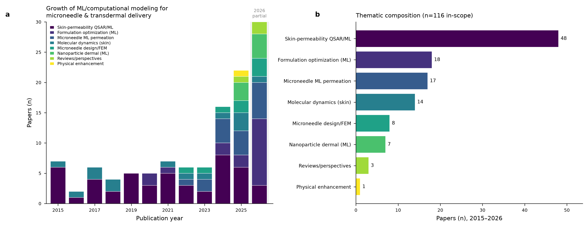
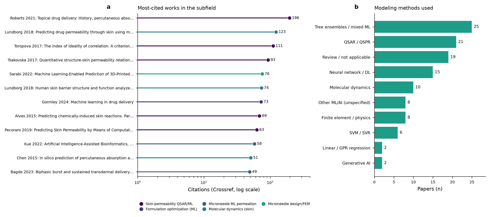

[HTML版を開く](paper.html)

# Toward Reliable Small-Data Machine Learning for Microneedle Drug Permeation: A Perspective and Research Proposal

## 1. Abstract

Microneedle-assisted delivery can create a controllable route across the skin barrier, but choosing a drug, device geometry, loading condition, and exposure time still relies heavily on experimental iteration. Machine learning is attractive in this setting because a model could organize heterogeneous design variables and help prioritize experiments. Its use is nevertheless constrained by the data regime that matters most: microneedle permeation studies are small, structured, and chemically narrow. This Perspective outlines a research proposal to improve the reliability of small-data machine learning for cumulative drug permeation through microneedle-treated skin. It is not a report of newly trained models or newly generated predictions.

The proposal is anchored in completed preparatory work. We curated a literature map of computational modeling for microneedle and transdermal delivery, compiled a unified set of measured skin-permeability compounds (reused, we now believe, from a public integrated resource rather than assembled independently — see §5.2), reproduced the published microneedle-permeation training data of Yuan et al., and prepared structural descriptors for a set of cosmetic ingredients. These assets expose a productive but non-trivial bridge: intact-skin permeability data can provide molecular context, whereas the microneedle data supply device, skin, loading, and time variables that define the delivery setting. They cannot simply be pooled as if they measured the same process.

We therefore propose a staged programme. It begins with traceable data curation and endpoint harmonization, then evaluates skin-permeability baselines and microneedle-permeation models under group-aware validation. The central proposed test is leave-one-drug-out evaluation, which asks whether a model can support decisions for a payload absent from its training set. Transfer learning from the curated skin-permeability resource, physics-informed augmentation, applicability-domain assessment, and post hoc interpretation are proposed as complementary safeguards rather than assumed solutions. Cosmetic ingredients would be considered only after this validation sequence, with explicit separation of compounds inside and outside the current molecular domain. The intended contribution is a transparent research framework that turns an encouraging proof of principle into a falsifiable programme for generalization, rather than overclaiming performance from a convenient split.

**Keywords:** microneedles; transdermal drug delivery; skin permeation; small-data machine learning; QSAR; transfer learning; applicability domain; research proposal

## 2. Introduction

Microneedles provide a compelling way to alter the practical boundary between a drug formulation and the skin. By creating micron-scale pathways through the stratum corneum, a microneedle device can change the transport problem from one governed solely by an intact barrier to one also shaped by device geometry, insertion, loading, skin type, and the time course of exposure. This makes microneedles relevant to a broad range of therapeutic materials and design strategies [1, 2], while also making their performance difficult to infer from any single experimental factor. Comprehensive accounts of microneedle biomedical devices emphasize the breadth of the engineering and translational design space that must be reconciled for successful use [2].

The outcome considered in this paper is **permeation**, not release alone. Release describes movement of drug from a microneedle matrix, coating, or reservoir into a surrounding medium. Permeation concerns drug that has crossed the skin and reached the receptor compartment. Retention and recovery are separate mass-balance questions involving drug remaining in skin, patch, donor, receptor, or wash fractions. Yuan et al. studied cumulative permeation through microneedle-treated skin; their outcome should not be re-labelled as microneedle release [1]. That distinction is consequential for modeling: a model of matrix dissolution may help explain one upstream process, but it is not automatically a model of receptor-side permeation.

Yuan et al. offered an important point of departure by comparing a Fick-law simulation with multiple linear regression, random forest, and XGBoost for microneedle-assisted permeation [1]. Their data set contained 191 observations from six payloads, and their machine-learning models used seven features: skin type, microneedle type, microneedle length, microneedle surface area, drug loading, permeation time, and molecular weight. The authors used a 7:3 random training/test split. In their reported comparison, XGBoost obtained an R² of 0.98 for both cumulative permeation amount and permeation percentage; the corresponding reported R² values were 0.95/0.97 for random forest, 0.95/0.82 for the Fick model, and 0.46/0.65 for multiple linear regression [1]. These are results reported by Yuan et al.; they are not results from the present project.

The study is also valuable because it identifies the limit that a favourable random split does not resolve. Yuan et al. deliberately excluded drugs from their learning data and qualitatively examined predictions for those omitted payloads in supplementary figures. The resulting discrepancies showed that their model was not ready to extrapolate reliably to a new drug. The authors linked this weakness to the broad distribution and high learned influence of drug loading, which could overwhelm drug-specific information when a payload was outside the training set [1]. It would therefore be inaccurate to state that Yuan et al. did not examine extrapolation at all. Rather, their informative qualitative check motivates a more systematic, quantitative leave-one-drug-out evaluation.

This is precisely the kind of problem that small-data machine learning reviews urge researchers to formulate carefully. The central challenge is not simply selecting a more flexible algorithm. It is determining what information is shared across observations, what is independent, which distributions are covered by the data, and how a validation design maps to the decision the model is supposed to support. Reviews by Xu et al. and Dou, Zhu, Merkurjev and colleagues describe approaches such as data-source expansion, transfer learning, active learning, and physics-guided strategies for small molecular and materials data [3, 5]. Achar and Keith also discuss small-data approaches in molecular and materials science [4]. Those ideas are relevant to microneedle permeation, but they need a domain-specific operationalization.

The objective of this manuscript is to articulate that operationalization. It reports only the preparatory assets that have already been completed: a literature map, curated data resources, a reproduction of Yuan et al.'s data, a descriptor pipeline, and an initial chemical-domain screen. All model fitting, cross-validation, transfer learning, data augmentation, SHAP analysis, and cosmetic-ingredient predictions remain future work. Accordingly, this manuscript is a Perspective and research proposal, not a completed empirical machine-learning study.

## 3. Related Work and Literature Landscape

The literature map prepared for this project provides a useful view of the landscape in which a small-data microneedle programme must operate. It screened 990 candidate records and retained 116 papers at the intersection of skin delivery and computational or machine-learning methods. The curated corpus spans 2015–2026 and rises sharply in the most recent years: it contains 16 papers from 2024, 22 from 2025, and 30 already logged for the partial 2026 period. Fifty-nine percent of the corpus was published from 2024 onward. These figures indicate active methodological interest, but they do not by themselves establish that broadly transferable microneedle-permeation data are available.

*Figure 1. Literature landscape assembled for this project. Panel (a) shows stacked annual publication counts across 2015–2026; the 2026 bar is partial. Panel (b) shows the thematic composition of the curated corpus (n=116) across all eight theme categories. Source: research/fig1_landscape.png, derived from research/literature_map_report.md.*

The largest category is skin-permeability QSAR/ML, with 48 papers. It provides the longest-standing computational tradition in the map: learning or correlating an intact-skin permeability endpoint from molecular information. Formulation optimization contributes 18 papers, and direct microneedle ML permeation contributes 17. Molecular-dynamics studies of skin account for 14 papers, and microneedle design or finite-element modeling contributes 8. These first five constitute the major thematic clusters. Three smaller categories cover nanoparticle dermal ML (7 papers), reviews or perspectives (3), and physical-enhancement modeling (1), so Figure 1b displays eight categories in total.

This composition highlights both continuity and fragmentation. Intact-skin QSAR offers a large molecular-information base, while microneedle work supplies an intervention-specific setting in which device variables and the skin condition matter. The molecular-dynamics and finite-element communities introduce mechanistic representations of barrier transport and device mechanics, respectively. For example, Lundborg et al. demonstrate a molecular-dynamics route to skin-permeability prediction [7], whereas Sarabi et al. show a machine-learning approach to microneedle feature prediction [8]. These bodies of work should be viewed as complementary sources of hypotheses and representations, not interchangeable evidence about a shared endpoint.

The map also identifies three recognizable research clusters: a Silpakorn University group working on microneedle, formulation, and artificial-intelligence-enabled design; a Stockholm cluster associated with molecular-dynamics models of skin; and a University of Surrey cluster associated with mechanistic and computational permeability modeling. The existence of these clusters is encouraging because it shows sustained expertise across formulation, device, and physics perspectives. It also warns against treating the field as a single harmonized data ecosystem. Different laboratories use different payloads, skins, device types, experimental designs, and endpoints. A model that succeeds within one set of conventions may fail when those conventions shift.

*Figure 2. Influence and modeling-method distribution in the curated corpus. Panel (a) shows Crossref citation counts for the most cited works on a logarithmic scale. Panel (b) shows the distribution of modeling methods, led by tree ensembles/mixed ML and QSAR/QSPR. Source: research/fig2_influence_methods.png, derived from research/literature_map_report.md.*

Figure 2 reinforces the mixed-method character of the field. Tree ensembles and mixed ML pipelines are the most frequent approach in the map, followed by QSAR/QSPR, while neural networks, molecular dynamics, and finite-element or physics methods also appear. The appropriate conclusion is not that one family has won. It is that a defensible microneedle-permeation programme must make its intended generalization target explicit before choosing a model class. The classic intact-skin literature remains an intellectual ancestor of molecular permeability work; Roberts et al. provide a broad account of topical delivery and percutaneous absorption [6]. Yet a microneedle device changes the transport context enough that molecular descriptors alone cannot stand in for device and experimental information.

For the present proposal, the landscape has two implications. First, the 17-paper microneedle-permeation category is substantially smaller than the 48-paper QSAR/ML category, making the case for careful reuse of molecular knowledge rather than training solely within the narrow microneedle set. Second, the coexistence of physics-oriented and data-driven approaches makes a hybrid strategy plausible, but not automatically valid. Any proposed integration must preserve the physical meaning, provenance, and uncertainty of its inputs. These implications motivate the research gap below.

## 4. Research Gap and Rationale

The literature map identifies four open gaps. The first is data scarcity and weak standardization. Microneedle permeation studies often consist of small groups of related time-course observations collected under a limited set of device and payload conditions. Such data are scientifically valuable, but their hierarchical structure makes observation-level random splitting prone to optimistic estimates. Related time points, replicates, or conditions can appear on both sides of a split while a genuinely unseen drug or device remains absent.

The second gap is a separation between the intact-skin QSAR literature and microneedle-specific models. A skin-permeability data resource can encode useful relationships among molecular properties and log Kp, but microneedle permeation also depends on loading, geometry, skin type, and exposure time. The two data sources therefore cannot be naively concatenated. Nevertheless, the molecular component of a skin-permeability model may be useful as a source-domain representation or prior. The proposed work treats that possibility as a testable transfer-learning question rather than an assumed benefit.

The third gap is the limited integration of physics with machine learning. Fickian transport models, molecular dynamics, and finite-element simulations embody different physical approximations and operate at different scales. They may offer constraints, synthetic scenarios, or diagnostic comparisons, but their role must be declared in advance. A physics-guided data augmentation procedure that treats simulated values as ground truth could merely amplify model assumptions. The proposal therefore places curation and provenance checks before any such augmentation, and requires separate reporting of empirical and simulated evidence in subsequent work.

The fourth gap is the near absence of generative and foundation-model approaches. This is an interesting frontier, but it is not the central problem addressed here. Generative methods cannot compensate for an unclear endpoint, uncontrolled split, or absent applicability-domain analysis. The proposed research concentrates on the first three gaps: traceable data resources, a principled bridge between QSAR and microneedle modeling, and appropriately constrained physics–ML integration.

Yuan et al.'s reported extrapolation failure makes these gaps concrete. Their supplementary omitted-drug checks are a useful signal that a model can fit within-payload relationships while lacking new-payload generalization [1]. The proposed novelty is not to claim that such a check has never been performed. It is to pre-specify leave-one-drug-out validation as the primary test of this generalization problem, then ask whether data reuse, transfer learning, and model-informed augmentation improve the test without leaking held-out payload information. This reframes the research question from “which algorithm has the highest convenient-split score?” to “what evidence supports use for an unfamiliar payload?”

## 5. Completed Preliminary Work

### 5.1 Literature mapping and evidence boundaries

The completed literature map is not a performance benchmark; it is an evidence inventory. It was assembled from Crossref and PubMed searches, deduplicated, and classified at the title-and-abstract level to retain the 116 papers described above. Its report records the search scope, theme labels, method labels, citation-count caveats, leading author clusters, and open gaps. The two figures reused in this manuscript are outputs of that completed mapping exercise. They are included as landscape evidence, not as new experimental or modeling results.

The map also establishes a deliberate citation boundary for this proposal. Claims about the field are grounded in the curated literature list and the five core small-data or microneedle references documented in the project context. The present manuscript does not add unverified citations or invented identifiers. Where a source is a project asset rather than a conventional publication, it is identified as such in the figure captions or data statement instead of being presented as a peer-reviewed external result.

### 5.2 Unified measured skin-permeability resource

We compiled a training resource of 214 unique compounds with measured skin permeability, standardized to log Kp in cm/h, drawing on public HuskinDB and SkinPiX records (129 and 103, respectively) plus 3 additional INRS records, and reconciling 21 compounds shared by HuskinDB and SkinPiX. **The 129/103/3 source split matches the reproduction dataset released alongside Asgarkhanova et al. (2026) [12], a CNRS-Strasbourg/INRS study that appears to have already built and published a closely related integrated resource** (data DOI 10.57745/ZUU1DH, the same repository this project's own research context already cited as the source of the integrated dataset, before this overlap was identified). **The matching source split does not mean the two resources are identical, however: publicly visible metadata for that data DOI describes a final deduplicated total of approximately 207–209 compounds — 5 to 7 fewer than this project's 214 — indicating the two integration efforts reconciled the HuskinDB/SkinPiX overlap differently, in a way we could not fully resolve from openly accessible sources.** The Asgarkhanova et al. full text is subscription-restricted; we were unable to access it to confirm its modeling methods, reported performance, or the precise cause of the total-count difference, so we do not know whether it addresses the same question this proposal does or exactly how its final compound set was curated. Pending that access, we treat the 214-compound table as a public resource this project **reused**, with an unresolved compound-count discrepancy against the closest known prior integration, not one it independently assembled from HuskinDB and SkinPiX, and we do not claim novelty for the data-integration step itself — only for its proposed use as a source domain for microneedle-permeation transfer learning (§6). Canonical SMILES, a measured permeability endpoint, measurement counts, source labels, and molecular descriptors are retained in the compiled file. The available descriptors include molecular weight, lipophilicity, polar surface area, hydrogen-bond counts, rotatable bonds, ring measures, carbon hybridization fraction, molar refractivity, and heteroatom count.

This data set is a completed research asset, not evidence that a project model has already learned a reliable skin-permeability relationship. It has not been used in this writing task to train, test, tune, or compare a model. Its value at this stage is practical: it makes the source-domain hypothesis inspectable. A future study can trace a molecular representation back to its source record and can distinguish molecules already present in the measured set from new candidates. The underlying public resources are acknowledged in the Data and Ethics Statement [9–11].

### 5.3 Reproduction of the Yuan et al. microneedle data

We reproduced the 191 observations reported in the Data S1 supplement to Yuan et al. and stored both the training-data table and a descriptor-augmented version. The six payload groups are lidocaine (73 observations), BSA (33), copper ions (24), GHK peptide (24), Rhodamine B (19), and caffeine (18). The records retain variables needed to represent the published experimental context, including drug loading, molecular weight, microneedle length and surface area, skin type, microneedle type, permeation time, and cumulative permeation outcomes.

The descriptor-augmented file explicitly distinguishes payloads for which a conventional small-molecule representation is appropriate from those for which it is not. BSA is treated as a protein and copper ions as non-small-molecule payloads rather than being forced into a descriptor representation intended for ordinary organic molecules. This is an important methodological choice: a convenient numeric encoding is not a justification for claiming chemical comparability. The reproduction preserves the original data structure for future validation design; it does not retrain Yuan et al.'s models or computationally reproduce their performance estimates.

### 5.4 Cosmetic-ingredient structures and initial domain screen

We obtained structural and descriptor information for 48 cosmetic ingredients from PubChem-derived records and organized them across functional categories such as whitening, antioxidant, moisturizer, barrier lipid, soothing, exfoliant, and penetration-enhancing ingredients. This is a candidate set for a future application study, not an output set of permeation predictions. Four ingredients—Niacinamide, Urea, Salicylic acid, and Ethanol—already have measured entries in the 214-compound resource. In future intact-skin log Kp modeling, they can serve as measured comparators or, if their records are excluded from every preprocessing, fitting, and model-selection step, as out-of-sample evaluation cases. These measurements cannot directly validate cumulative permeation through microneedle-treated skin.

An initial molecular-domain screen based on the measured resource's molecular-weight and lipophilicity ranges places 38 of the 48 ingredients within both ranges and 10 outside at least one range. Of the 38 in-range ingredients, the four with existing measurements leave 34 in-range, unmeasured candidates for a future prediction workflow. “Out of range” should not be paraphrased as a single class of high-molecular-weight lipids. The source file shows both highly lipophilic and highly hydrophilic forms outside the current molecular space, and only some out-of-range records are driven by molecular weight. The appropriate present conclusion is limited to this: the 10 compounds lie outside the current training chemical space defined by molecular weight and logP.

### 5.5 Descriptor pipeline and classical baseline

The completed descriptor module provides auditable canon_smiles, compute_descriptors, potts_guy_baseline, and check_applicability_domain functions. Together, they canonicalize SMILES, calculate a fixed molecular-descriptor panel, implement the classical baseline relationship, and perform a molecular-weight/lipophilicity applicability check. The implemented Potts–Guy relationship is:

$$
\log K_p = -2.7 + 0.71 \cdot \log P - 0.0061 \cdot MW.
$$

This equation is documented here because it is part of the planned baseline protocol. It is not reported as a validated project model, and no compound-level output from the existing baseline column is presented in this manuscript. In particular, the 48 values already present in the cosmetic descriptor file are deterministic formula outputs that have not been validated for this project’s intended use. They are deliberately excluded from the paper’s results, tables, figures, and claims.

## 6. Proposed Methodology and Future Work

### 6.1 Design principle: validate the decision, not just the row

Future work will begin by defining the intended decisions separately for the intact-skin and microneedle domains. For the intact-skin resource, the endpoint is log Kp in cm/h. For the microneedle resource, the outcomes reproduced from Yuan et al. are cumulative permeation amount and cumulative permeation percentage through microneedle-treated skin. These targets are related but not identical. The proposal will therefore retain their distinction during preprocessing, model construction, and interpretation rather than manufacturing a single universal label.

The central validation unit must also reflect the data-generating process. Time points belonging to the same permeation curve are not independent new drugs; nor are repeated conditions from the same payload interchangeable with an unseen payload. Future analysis will preserve available group structure and will document any missing grouping metadata as a limitation. It will compare conventional within-domain validation with group-aware validation, but it will not use observation-level random splitting as the sole evidence for real-world generalization.

The primary proposed microneedle test is leave-one-drug-out cross-validation. Each evaluation fold will hold out every observation for one payload while the model-development steps are restricted to the remaining payloads. Preprocessing, feature selection, hyperparameter selection, augmentation choices, and transfer-learning choices will be nested inside the training portion of each fold. This protocol is designed to answer the question raised by Yuan et al.'s supplementary checks: can a method support prediction when the payload itself has not appeared in the training data? Its results are not yet available and are not inferred here.

Before fitting any model, future work will write a data dictionary and curation log. The log will cover endpoint units, source provenance, canonical structures, duplicates, salts or multicomponent records, missing descriptors, experimental flags, and any exclusion decisions. Data hygiene will be treated as a modeling decision rather than hidden preprocessing. A suspicious point should not be removed solely because it weakens an apparent fit; a documented scientific rationale and a sensitivity analysis will be required.

### 6.2 Stage A: curate and characterize the source domain

The first modeling stage will focus on the 214-compound measured skin-permeability resource. The aim is not simply to create a benchmark score. It is to establish a reproducible source-domain model and to understand the boundaries of its training chemistry. The planned checks include endpoint-distribution review, descriptor correlation and collinearity assessment, canonical-SMILES duplication review, source-aware inspection, and an explicit applicability-domain definition. Molecular weight and logP range checks provide an initial screen, but future work should supplement them with a multivariate domain diagnostic suited to the selected representation.

The planned baseline hierarchy begins with the Potts–Guy equation above and a transparent linear model, followed by nonlinear methods such as random forest, XGBoost, and Gaussian-process regression. The purpose of this hierarchy is diagnostic. A simpler model may reveal whether a proposed gain is genuinely related to nonlinear structure or merely to a permissive split. Future reporting will make the comparison fair by applying the same data partitions, preprocessing discipline, and endpoint definition to all candidates. It will report predictive error, calibration, uncertainty where available, and applicability-domain coverage; it will not rely on a single headline statistic.

The resulting source-domain artifact will be versioned with the descriptor schema and the curation rules used to create it. This is necessary for any later transfer-learning experiment. If the source model changes after observing target-domain performance, the project will treat that change as a new experiment rather than quietly folding it into an apparently pre-specified workflow.

### 6.3 Stage B: establish an honest microneedle baseline

The second stage will revisit the reproduced Yuan data with a goal different from retroactively claiming replication success. It will construct transparent baselines for the microneedle outcome and evaluate them using the proposed group-aware and leave-one-drug-out protocols. Candidate models will include a linear baseline, tree-based methods compatible with Yuan et al.'s comparison, and a probabilistic regression approach when the data structure and uncertainty assumptions permit it. The study will document which features are available for each payload type and how non-small-molecule payloads are handled.

This stage will also preserve the distinction between two modeling questions. The first is interpolation among conditions represented by known payloads, device types, and skin types. The second is extrapolation to a new payload. A model may be useful for the former yet unreliable for the latter. Future reporting will therefore present these conditions separately rather than averaging them into a single result. The leave-one-drug-out test is deliberately demanding because its failure would be scientifically informative: it would identify a gap in the data or representation rather than invite unsupported claims of robustness.

The published Fick-law framework will be treated as a mechanistic comparator and source of constraints, not as an interchangeable machine-learning baseline. Its assumptions about geometry, diffusion, and parameter availability should be documented alongside any comparison. The proposal does not assert that a physics model will necessarily outperform or correct a statistical model. Instead, it asks where a mechanistic representation agrees with, complements, or exposes limitations in data-driven predictions.

### 6.4 Stage C: test transfer learning as a hypothesis

The core proposed intervention is transfer learning from the intact-skin permeability resource to the microneedle domain. The conceptual rationale is that molecular properties related to transport through skin may supply a useful starting representation for a microneedle setting, even though microneedle devices introduce additional variables. The source domain contains measured log Kp observations across diverse small molecules; the target domain contains a smaller number of microneedle permeation observations with device and experimental features. Transfer learning will be considered successful only if it improves a pre-specified new-payload evaluation without degrading transparency or leaking target information.

Several design questions require explicit resolution before the experiment. The project must decide which molecular representation can be meaningfully shared between domains, how to encode microneedle and skin variables, how to account for the differing endpoints, and how to treat BSA and copper ions. A single model architecture may not be appropriate for every payload class. One defensible alternative is to use a shared small-molecule representation only for payloads with compatible descriptors and to keep non-small-molecule cases in a separately specified analysis. Another is to compare feature-based transfer with a more modest model-stacking or prior-informed approach. These are methodological alternatives to be tested, not already selected conclusions.

To prevent data leakage, the held-out drug in a leave-one-drug-out fold will remain absent from all target-domain fitting decisions. In the primary unseen-payload analysis, any source-domain record chemically identical to that held-out payload will also be excluded from pretraining and from preprocessing learned on the source data. A separately labeled auxiliary analysis may ask whether a legitimately available intact-skin measurement helps predict microneedle permeation, but it will not be described as unseen-chemistry generalization. The study will also compare transfer learning with a target-only baseline. A transfer procedure that merely adds complexity without improving the appropriate held-out scenario will be rejected rather than retained for narrative appeal.

### 6.5 Stage D: physics-informed augmentation with provenance controls

The proposal includes a possible physics-informed augmentation path, motivated by the Fickian description used by Yuan et al. and by the broader small-data literature [1, 5]. Future work may use a mechanistic model to generate restricted synthetic scenarios, impose physically plausible constraints, or explore sensitivity to device parameters. However, simulated records will never be silently blended with empirical observations. Each record will retain a provenance label, the governing assumptions will be documented, and model performance will be assessed separately on empirical held-out observations.

This safeguard matters because a synthetic data set can improve an internal metric by making a model better at reproducing the simulator rather than the experiment. Augmentation will therefore be tested as an ablation: empirical-only and empirical-plus-simulation workflows will be compared under identical held-out empirical evaluation. If augmentation produces unstable results or shifts predictions beyond an interpretable domain, it will be treated as an unsuccessful intervention. The point of the physics component is not to decorate a machine-learning pipeline; it is to make assumptions testable.

### 6.6 Stage E: interpretation, uncertainty, and applicability

Future work will use SHAP-based analysis and complementary diagnostics only after model selection and validation rules have been fixed. Interpretation will be used to investigate whether a proposed model relies excessively on variables such as loading, time, or a proxy for payload identity. It will not be presented as causal proof. The known feature-importance pattern reported by Yuan et al.—surface area and time for permeation percentage, loading and time for permeation amount—provides a literature-based diagnostic expectation, not a result that this project may claim in advance [1].

Applicability-domain assessment will be a required output, not a post hoc disclaimer. The study will first use the existing molecular-weight/logP screen, then evaluate a representation-aware domain measure suited to the chosen model. An in-domain label should indicate similarity to the data used for training, not clinical efficacy or an assurance of accurate delivery. Conversely, an out-of-domain label should trigger caution, experimental prioritization, or exclusion from automated ranking rather than an arbitrary numerical adjustment.

Uncertainty communication will include the limitations of the data, the variation induced by validation groups, and the provenance of any synthetic inputs. A prediction with a point estimate but no information about domain or uncertainty will not be considered an adequate decision aid for this programme. This is particularly important when comparing drug classes, device designs, or skin conditions that have sparse representation in the current data assets.

### 6.7 Stage F: prospective cosmetic-ingredient application

The cosmetic-ingredient resource will be used only after the source-domain and microneedle-domain validation stages have been completed. The planned workflow begins with identity and descriptor checks, followed by the existing molecular-domain screen. The four ingredients already represented in the measured 214-compound resource will be treated as measured comparators, or as held-out evaluation cases for intact-skin log Kp only under the full-exclusion rule above; they will not be advertised as newly predicted compounds or used to validate microneedle-treated cumulative permeation. The 34 in-domain but unmeasured candidates may be considered for future model application, provided their predictions are accompanied by domain status and uncertainty information.

The 10 ingredients outside the current molecular-weight/logP space will remain quarantined from any decision-oriented ranking unless new evidence expands the training chemistry. This is a feature, not a failure, of the proposed workflow. A useful small-data model should be allowed to abstain when its supporting data do not cover a compound. Future experimental work could prioritize selected out-of-domain compounds precisely because they are informative for expanding the data resource, but this paper does not propose their delivery values.

The final application will retain the endpoint distinction established at the beginning of this paper. A model trained on intact-skin log Kp and a model trained on microneedle-treated cumulative permeation should not be conflated. Any cosmetic use case will state which endpoint is being estimated, which device context is assumed, and whether the result is an in-domain research hypothesis requiring experimental confirmation.

## 7. Anticipated Contributions

If carried out as proposed, this programme could make several contributions. First, it would provide a more stringent account of small-data generalization for microneedle permeation by making unseen-payload performance a primary evaluation question. That contribution would remain valuable even if the initial models fail: a well-documented failure could help identify whether limitations arise from chemical diversity, device diversity, endpoint alignment, or representation quality.

Second, the work would establish an auditable bridge between intact-skin permeability QSAR and microneedle-specific permeation modeling. The bridge is deliberately conditional. It would test whether molecular information learned from measured log Kp data is useful once microneedle and experimental variables are introduced, rather than assuming that data volume alone confers transferability.

Third, the proposal would create a transparent basis for physics–ML comparison. Separating empirical from simulated inputs, preserving provenance, and evaluating on held-out empirical data would make any apparent benefit interpretable. This could inform later work that integrates molecular dynamics, finite-element mechanics, or transport models without overstating their evidentiary status.

Finally, the programme could offer a disciplined route toward cosmetic applications. Instead of presenting a list of attractive ingredients with unverified numerical outputs, it would distinguish measured comparators, in-domain candidates, and out-of-domain compounds. That distinction could make subsequent experimental prioritization more useful to both pharmaceutical and cosmetic formulation research.

## 8. Limitations

This proposal begins from a deliberately small microneedle data resource: six payload groups are not enough to establish broad chemical generalization. Leave-one-drug-out validation is more appropriate than a row-wise split for the intended question, but it also yields a limited number of held-out payload scenarios. Its estimates will therefore have substantial uncertainty and should not be treated as a final population-level guarantee. A future study will need additional payloads, device designs, skin sources, and independently generated data to strengthen external validity.

The 214-compound skin-permeability resource is richer in molecular diversity than the microneedle data, but its endpoint and experimental context differ. Its use as a source domain may help, have no effect, or introduce misleading bias. Transfer learning is consequently a hypothesis, not an entitlement granted by data availability. The project must remain open to the possibility that the two domains are insufficiently aligned for a shared representation to be useful.

The current cosmetic resource also has important limits. It contains structures and descriptors, but most ingredients lack matched measured permeability values in the compiled training set. The four measured overlaps can support the qualified intact-skin checks described above, but they cannot validate microneedle-treated permeation and are not enough to support a broad cosmetic claim. In addition, the 10 ingredients outside the initial molecular-weight/logP domain include chemically different reasons for being out of range. A single extrapolation rule would conceal that diversity.

The literature map is a structured, useful survey but not a systematic review with exhaustive database coverage. Its labels were assigned from title-and-abstract material, its citation counts are time-sensitive, and 2026 is explicitly partial. It should guide research framing rather than serve as a definitive census. Similarly, the published literature cited here supports a proposal rationale; it does not substitute for a completed analysis of the local data.

There are also endpoint and experimental-design limitations. Cumulative permeation through microneedle-treated skin is not release-only and is not skin retention. Device type, insertion conditions, skin source, loading, time, and assay conventions may encode unobserved confounders. Missing group identifiers can restrict the rigor of future grouped validation. For these reasons, any eventual model must be interpreted as a decision-support hypothesis within a defined domain, not as a clinical, formulation, or regulatory conclusion.

## 9. Data and Ethics Statement

The completed preparatory assets described in this manuscript use public databases and published supplementary data. The unified skin-permeability resource draws on HuskinDB, SkinPiX, and an integrated QSPR data resource [9–11] that this project reused rather than independently assembled, most likely overlapping the resource behind Asgarkhanova et al. (2026) [12] (see §5.2). The microneedle data were reproduced from the published supplemental material associated with Yuan et al. [1]. The cosmetic-ingredient structures and descriptors were assembled from public PubChem-derived records. No new human, animal, or wet-lab experiment was performed for this writing task, and no model was trained or run to create results for this manuscript.

Future work using these resources will preserve source provenance, licensing constraints, and data-use restrictions. Subscription-only material will not be redistributed. Any future wet-lab extension must be separately designed under applicable laboratory standard operating procedures, training, ethics, biosafety, and institutional approvals. The present proposal does not assert that public secondary data eliminate the need for those approvals.

## 10. References

1. Yuan Y, Han Y, Yap CW, et al. Prediction of drug permeation through microneedled skin by machine learning. *Bioengineering & Translational Medicine*. 2023;8(6):e10512. doi:10.1002/btm2.10512.
2. Zheng et al. Microneedle biomedical devices. *Nature Reviews Bioengineering*. 2023. doi:10.1038/s44222-023-00141-6.
3. Xu et al. Small data machine learning in materials science. *npj Computational Materials*. 2023. doi:10.1038/s41524-023-01000-z.
4. Achar SK, Keith JA. Small Data Machine Learning Approaches in Molecular and Materials Science. *Chemical Reviews*. 2024. doi:10.1021/acs.chemrev.4c00957.
5. Dou, Zhu, Merkurjev, et al. Machine Learning Methods for Small Data Challenges in Molecular Science. *Chemical Reviews*. 2023. doi:10.1021/acs.chemrev.3c00189.
6. Roberts et al. Topical drug delivery: History, percutaneous absorption, and product development. *Advanced Drug Delivery Reviews*. 2021. doi:10.1016/j.addr.2021.113929.
7. Lundborg et al. Predicting drug permeability through skin using molecular dynamics simulation. *Journal of Controlled Release*. 2018. doi:10.1016/j.jconrel.2018.05.026.
8. Rezapour Sarabi et al. Machine Learning-Enabled Prediction of 3D-Printed Microneedle Features. *Biosensors*. 2022. doi:10.3390/bios12070491.
9. HuskinDB data resource. doi:10.1038/s41597-020-00764-z.
10. SkinPiX data resource. Recherche Data Gouv. doi:10.57745/7FHQOY.
11. Integrated QSPR skin-permeability data resource. Recherche Data Gouv. doi:10.57745/ZUU1DH.
12. Asgarkhanova et al. [title unconfirmed; full text subscription-restricted]. *Molecular Informatics*. 2026. doi:10.1002/minf.70030.
