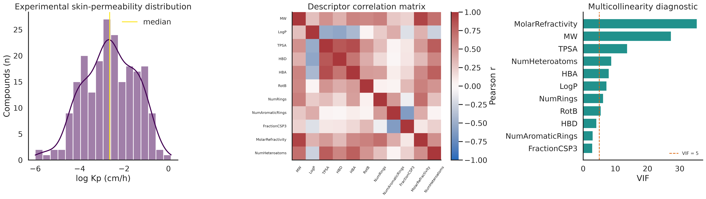
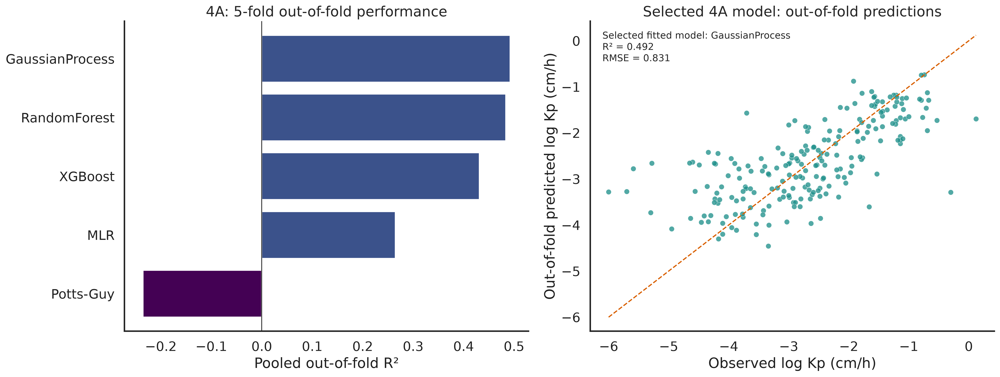
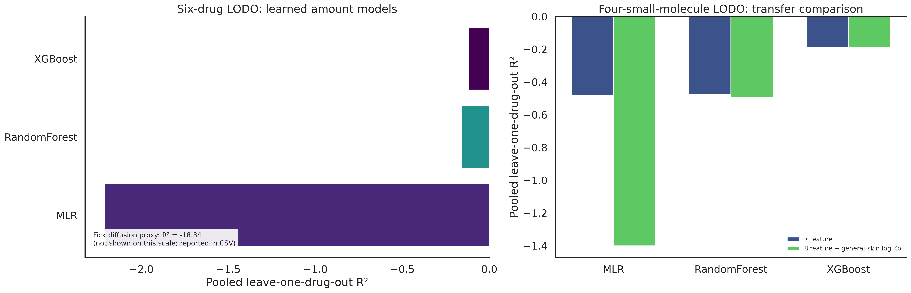
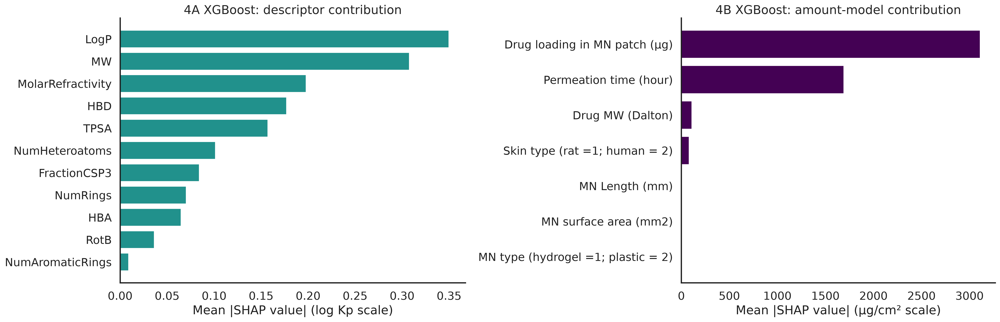
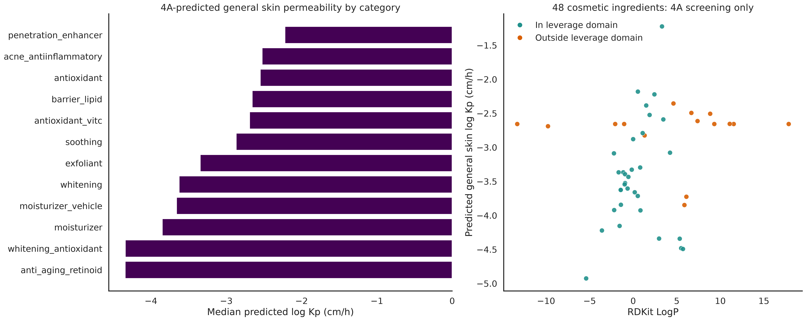

[HTML版を開く](paper.html)

# Transfer Learning for Small-Data Microneedle Drug Permeation QSAR: A Reproducible Evaluation of General Skin Knowledge, Extrapolation, and Physics-Guided Augmentation

## Abstract

Microneedle-assisted drug permeation datasets are valuable but small, and a high random-split score can obscure weak performance on a previously unseen drug. We implemented a fully saved and fixed-seed analysis pipeline to evaluate this problem without treating general skin permeability and microneedle permeation as interchangeable endpoints. The pipeline first curated a 214-compound experimental skin-permeability dataset, then compared a Potts–Guy baseline, multiple linear regression (MLR), random forest (RF), XGBoost, and Gaussian process regression (GPR) by shuffled five-fold cross-validation. GPR was the best fitted general-skin model, with pooled out-of-fold (R^2=0.492), RMSE (=0.831), and MAE (=0.622) log (K_p) units. We next reconstructed the 191-observation, six-drug Yuan et al. microneedle dataset using its seven published experimental features. On a fixed random 70:30 split, XGBoost reached (R^2=0.967) and RMSE (=562.247) µg/cm² for permeation amount, close to—but not identical with—the previously reported random-split result. The apparent performance did not transfer to a harder six-drug leave-one-drug-out (LODO) evaluation: XGBoost pooled (R^2) was (-0.122) and RMSE was (4,777.673) µg/cm². A source-domain GPR prediction of general skin log (K_p) was added as an eighth feature only for four Yuan drugs with valid RDKit descriptors; it did not improve XGBoost LODO performance on the four-drug subset ((R^2=-0.190) for both seven- and eight-feature variants). XGBoost feature importance assigned 0.625 of its gain importance to drug loading; a percentage-first model that excluded loading from its learned component improved six-drug amount LODO (R^2) to (0.028), while remaining far from deployable. A separate 100-point, explicitly synthetic Potts–Guy grid reduced, rather than improved, a two-descriptor XGBoost QSAR score ((R^2=0.312) to (0.277)). TreeSHAP emphasized LogP and MW in the general-skin XGBoost model and drug loading plus permeation time in the microneedle amount model. Finally, all 48 cosmetic ingredients were screened only with the general-skin 4A model: 33 were inside the leverage domain, and no microneedle design parameters were assumed. The results demonstrate that random-split fit and a broadly useful skin-permeability prior do not by themselves solve new-drug microneedle extrapolation.

**Keywords:** microneedle; skin permeability; QSAR; transfer learning; leave-one-drug-out; XGBoost; applicability domain; SHAP; small data

## 1. Introduction

Microneedles (MNs) create transient transport pathways through the stratum corneum and can enable delivery of molecules that are poorly transported across intact skin. Their performance nevertheless depends on both molecular properties and an experimental design space that includes drug loading, release time, needle geometry, needle material, and skin type. This mixture of molecular and process variables makes in vitro evaluation costly and gives predictive modeling a clear practical role. Yuan et al. assembled a dataset of MN-assisted permeation observations for six chemically diverse permeants and compared Fick-law simulation, MLR, RF, and XGBoost models [1]. Their random train/test evaluation reported XGBoost (R^2=0.98) for both permeation amount and percentage, but their discussion also identified large deviations for a drug absent from the training set and highlighted disproportionate reliance on drug loading [1]. Those two observations motivate a more stringent evaluation rather than a claim that a high random-split score is a complete solution.

Small-data machine learning studies distinguish interpolation within a heterogeneous but familiar table from extrapolation to a new material, molecule, or experimental regime. They also motivate strategies such as transfer learning, careful validation, physics-based augmentation, and explicit applicability-domain checks [2,3]. These strategies are attractive for MN delivery because building a balanced matrix across drug identity, loading, MN architecture, and skin source is experimentally difficult. However, a transfer feature should be introduced only where its source representation is meaningful. In particular, a conventional small-molecule skin-permeability model cannot provide structurally meaningful RDKit descriptors for bovine serum albumin (BSA) or a copper ion. Similarly, a cosmetic-ingredient structure table is not a substitute for an MN permeation experiment: it lacks drug loading, MN length, MN surface area, MN type, skin type, and permeation time.

This study therefore treats three data assets as different scientific objects. First, an experimental 214-compound skin-permeability table, integrated from HuskinDB/SkinPiX-related sources, supplies molecular descriptors and experimental log (K_p) values. HuskinDB and recent curated skin-permeability updates make molecular QSPR evaluation possible but do not encode MN-specific experimental design [4,5]. Second, the reconstructed Yuan table contains 191 MN-permeation observations for BSA, copper ions, GHK peptide, Rhodamine B, lidocaine, and caffeine, with seven published experimental features and two outcomes [1]. Third, a 48-ingredient cosmetic table contains molecular descriptors but not MN experimental parameters. The distinction is central: the 214-compound table can support general-skin QSAR, the 191-observation table can support MN-specific modeling, and the cosmetic table can receive only general-skin screening predictions in the present work.

The study has five aims. First, we perform traceable curation and exploratory analysis of the 214-compound dataset, including duplicate checks, descriptor consistency checks, distributional flags, multicollinearity diagnostics, and leverage-based applicability-domain (AD) evaluation. Second, we compare a fixed Potts–Guy baseline, MLR, RF, XGBoost, and GPR with the required five-fold validation. Third, we reproduce the available Yuan modeling setup as closely as the reconstructed data and supplied supplementary code allow, then quantify new-drug performance with LODO rather than an active-learning pool restriction. Fourth, we evaluate a deliberately limited feature-transfer approach: a general-skin log (K_p) prediction becomes an eighth input for the four structurally eligible Yuan drugs only. We also quantify loading reliance, test a loading-normalized mitigation, and test an explicitly flagged physics-based augmentation. Fifth, we use SHAP to interpret fitted tree models and apply the 4A general-skin model to cosmetics without inventing MN conditions.

The paper is intentionally a computation report, not a prospective claim of clinical or formulation performance. Every result below comes from the fixed-seed script `../research/transfer_learning_analysis.py` and a saved CSV or PNG named at the point of use. Negative results are retained because they delimit what the current data support.

## 2. Materials and Methods

### 2.1. Data assets and boundaries

The general skin-permeability dataset was read from `../research/skin_permeability_training_set.csv`. It contains 214 experimentally derived, canonical-SMILES-unique compounds, eleven RDKit descriptors, log (K_p) in cm/h, measurement counts, and provenance labels. The input count and all downstream run facts are saved in `../research/transfer_learning_run_manifest.csv`. The eleven descriptor inputs were MW, LogP, topological polar surface area (TPSA), hydrogen-bond donors (HBD), hydrogen-bond acceptors (HBA), rotatable bonds (RotB), ring count, aromatic-ring count, fraction sp3 carbon, molar refractivity, and heteroatom count. Descriptor calculation and the classical Potts–Guy equation were imported from the existing `../research/descriptors.py` module rather than reimplemented. That function applies `log Kp = -2.7 + 0.71 logP - 0.0061 MW`, consistent with the classical molecular-size/lipophilicity relationship [6].

The MN dataset was read from `../research/yuan2023_dataset_with_descriptors.csv`. Its seven original predictors were drug loading in the MN patch, drug molecular weight, MN length, skin type, MN type, MN surface area, and permeation time. The two observed outcomes were permeation percentage and permeation amount (µg/cm²). The reconstructed table contains 191 observations. The small-molecule indicator identifies 134 rows from GHK peptide, Rhodamine B, lidocaine, and caffeine. The remaining 57 rows are BSA and copper-ion observations; they remain in all seven-feature reproduction and six-drug LODO analyses but are excluded from descriptor transfer because an RDKit small-molecule representation is structurally inapplicable.

The cosmetics table was read from `../research/cosmetic_ingredients_descriptors.csv`. It contains 48 ingredients and their molecular descriptors, but no MN experiment variables. Consequently, no cosmetic ingredient was passed through a 4B MN model. All cosmetic outputs in this paper are general skin log (K_p) predictions from 4A, explicitly labeled `is_microneedle_prediction=False` in `../research/phase5_cosmetic_4a_predictions.csv`.

### 2.2. Curation, descriptor validation, EDA, and applicability domain

The 214-row input was checked for missing values, duplicate canonical SMILES, SMILES canonicalization agreement, and exact agreement between saved and freshly calculated descriptor values. The original research plan mentioned a SkinPiX `notes`-field “suspicious point” flag, but this processed CSV has no `notes` column. A file search under `research/` also found no raw HuskinDB or SkinPiX source file from which that flag could be recovered. We therefore used transparent statistical checks instead of silently removing records: a 1.5×IQR log (K_p) rule, absolute population z-score above three, and standardized-descriptor leverage. All checks, including the no-raw-source finding, are saved in `../research/phase2_curation_checks.csv` and `../research/phase2_curation_summary.csv`.

Leverage was computed from a standardized descriptor design matrix with an intercept using the diagonal of (H=X(X^TX)^{-1}X^T), with a pseudoinverse for numerical stability. The Williams-style threshold was (3(p+1)/n), where (p=11) descriptors and (n=214). This leverage test complements rather than overwrites the existing simple MW/LogP range flags in the cosmetic input.

EDA used the experimental 214-row target distribution, Pearson correlation matrix, and variance inflation factors (VIF). The corresponding tables are `../research/phase3_eda_summary.csv`, `../research/phase3_descriptor_correlation.csv`, and `../research/phase3_vif.csv`; Figure 1 is `../research/fig_transfer_phase3_eda.png`. A separate cosmetic EDA plot used the already implemented Potts–Guy calculation as a heuristic, not an observed cosmetic permeability measurement. Cosmetic ingredients were divided at their dataset-median RDKit LogP, and the underlying values are stored in `../research/phase3_cosmetic_eda.csv` and visualized in `../research/fig_transfer_phase3_cosmetic_eda.png`.

### 2.3. General skin-permeability QSAR (4A)

We evaluated the Potts–Guy equation, MLR, RF, XGBoost, and GPR on the same shuffled five-fold split sequence (`random_state=42`). The Potts–Guy prediction is parameter-free relative to this dataset; each fold uses the formula only on that fold’s held-out rows. MLR and GPR were wrapped in a standardization pipeline. RF used 500 trees. XGBoost used 400 estimators, learning rate 0.03, maximum depth three, minimum child weight two, subsampling 0.9, and column subsampling 0.9. GPR used a standardized anisotropic RBF-plus-white-noise kernel with three optimizer restarts. Exact settings are in the source script, and every out-of-fold prediction is saved in `../research/phase4a_cv_predictions.csv`.

The selection rule chose the fitted model with the smallest pooled out-of-fold RMSE, using (R^2) only as a tie-breaker. The selected model and rule are saved in `../research/phase4a_final_model_selection.csv`; performance is in `../research/phase4a_model_performance.csv`. After model selection, the selected model was refit on all 214 experimental skin observations only for source-domain feature generation and cosmetic screening. The cosmetic leverage values were calculated relative to the complete 214-compound descriptor matrix and saved together with simple-range flags in `../research/phase4a_applicability_domain.csv` and `../research/phase4a_ad_comparison.csv`.

### 2.4. Yuan-model reproduction and a transparent physical baseline

Yuan et al. state that their 191 observations were randomly divided 70:30 into training and test sets [1]. We used the same proportion with `random_state=42`, not a claim to reproduce their unpublished row assignment. MLR was fitted without an intercept to mirror the supplied SI2 expression `Results ~ . - 1`; RF used 500 trees and target-specific `max_features` settings of five (amount) or six (percentage); XGBoost used the published target-specific settings, namely depth four, learning rate 0.4, and 100 rounds for amount, and depth three, learning rate 0.2, and 45 rounds for percentage. All test predictions are in `../research/phase4b_random_split_predictions.csv`, settings are in `../research/phase4b_model_hyperparameters.csv`, and metrics are in `../research/phase4b_random_split_performance.csv`.

The supplied SI2 document was read successfully. It contains a finite-difference C solver for Fick’s second law and R code for the three data-driven models. It does not provide drug-specific diffusion coefficients or enough complete per-row geometry information to rerun its C solver across all 191 observations. We therefore did not falsely label a new finite-difference calculation as an exact Yuan rerun. Instead, the fourth comparison is explicitly named `Fick_diffusion_proxy`: an analytical complementary-error-function diffusion baseline using the paper’s 1 mm skin-thickness assumption, an MW-scaled diffusion coefficient bounded to the cited 50–1000 µm²/min range, and no fitted parameters. Its per-row inputs and predictions are preserved in `../research/phase4b_fick_proxy_parameters.csv`. This is useful as a transparent physical reference, but it is not an exact reimplementation of the original C solver.

### 2.5. LODO, feature transfer, loading mitigation, and physics augmentation

For LODO, all observations from one drug were held out while every observation from the other five drugs trained the model. This differs from an acquisition-strategy evaluation: no pool restriction was imposed. RF and XGBoost were mandatory, and MLR plus the Fick proxy were retained for context. The six-drug prediction rows, aggregate performance, and per-held-out-drug performance are respectively `../research/phase4b_lodo_predictions.csv`, `../research/phase4b_lodo_performance.csv`, and `../research/phase4b_lodo_fold_metrics.csv`.

For feature transfer, the selected 4A model predicted general skin log (K_p) for only the 134 small-molecule Yuan rows. The four drug-level values and their repeated row assignment are saved in `../research/phase4b_transfer_features.csv`. The seven original features and an eight-feature variant containing `predicted_general_skin_logKp` were then compared in four-drug LODO. This comparison is deliberately restricted to the same eligible molecules; it does not imply that BSA or copper ions were represented by synthetic molecular descriptors. Full prediction rows and metrics are in `../research/phase4b_transfer_lodo_predictions.csv` and `../research/phase4b_transfer_lodo_performance.csv`.

To quantify the loading imbalance highlighted by Yuan et al. [1], an XGBoost amount model was fitted on all 191 rows and its gain importances were saved. A mitigation model learned permeation percentage from the six non-loading inputs, using a shallow, regularized XGBoost configuration; predicted percentage was then multiplied by the observed experimental loading to reconstruct amount. This does not erase the physical mass-balance role of loading; it removes loading from the learned nonlinear component. Feature-importances, LODO rows, and aggregate results are stored in `../research/phase4b_bias_mitigation_feature_importance.csv`, `../research/phase4b_bias_mitigation_lodo_predictions.csv`, and `../research/phase4b_bias_mitigation_performance.csv`.

Physics-guided augmentation was deliberately isolated from experimental records. A 10×10 MW–LogP grid yielded 100 Potts–Guy pseudo-points, each marked `is_synthetic_physics_augmented=True` in `../research/phase4b_physics_augmented_points.csv`. We compared a two-descriptor XGBoost model trained on experimental 4A rows alone with the same model trained on experimental fold data plus the separately flagged pseudo-points. Test rows always remained experimental. The design avoids inventing values for the remaining nine descriptors and avoids reporting a combined “experimental” sample size. Prediction rows and metrics are saved in `../research/phase4b_physics_augmentation_cv_predictions.csv` and `../research/phase4b_physics_augmentation_metrics.csv`.

### 2.6. SHAP interpretation and cosmetic screening

TreeSHAP was applied to a full-data 4A XGBoost model and a full-data 4B XGBoost amount model. The selected 4A model remained GPR; XGBoost was used for the 4A SHAP analysis because its tree explanations are direct and reproducible. Per-row SHAP values and mean absolute SHAP summaries are saved in `../research/phase5_shap_4a_values.csv`, `../research/phase5_shap_4a_feature_importance.csv`, `../research/phase5_shap_4b_values.csv`, and `../research/phase5_shap_4b_feature_importance.csv`.

The selected 4A GPR was then refit on the 214 experimental skin observations and used to generate cosmetic screening values. We preserved category, Potts–Guy baseline, simple AD flags, leverage, and a scope note. Category summaries are in `../research/phase5_cosmetic_category_summary.csv`. Four cosmetic structures occur in the training set; those matches are saved in `../research/phase5_cosmetic_training_overlap.csv` and are explicitly treated as in-training overlaps rather than an external validation set. A scope-aware, non-rankable 4A versus 4B metric table is `../research/phase5_model_scope_comparison.csv`, because log (K_p) and MN permeation amount are different endpoints.

## 3. Results

### 3.1. Curation preserved the experimental 214-compound set while identifying descriptor-space extremes

The 214 experimental compounds had no missing values, no duplicate canonical SMILES, no RDKit re-canonicalization mismatch, and no saved-versus-recomputed descriptor mismatch (`phase2_curation_summary.csv`). The log (K_p) distribution had mean (-2.657), standard deviation (1.168), median (-2.650), and range from (-6.000) to (0.120) (`phase3_eda_summary.csv`). Neither the 1.5×IQR bounds of (-6.156) and (0.874) nor the absolute-z-score-above-three check flagged a target-value outlier. Eleven compounds exceeded the descriptor-leverage threshold of (0.1682), but there was no independent indication that they were erroneous. We therefore retained all 214 experimental observations and treat the leverage result as an AD warning rather than a deletion criterion.

The descriptor matrix was multicollinear in several physically related dimensions. The largest VIFs were 35.403 for molar refractivity, 27.383 for MW, 13.761 for TPSA, and 8.812 for heteroatom count (`phase3_vif.csv`). This finding supports reporting multiple model families rather than interpreting any one raw linear coefficient as a causal molecular effect. It also explains why a GPR, which can represent smooth nonlinear dependence after standardization, could be competitive despite a modest dataset size. Figure 1 shows the target distribution, the correlation matrix, and VIF values.

The cosmetic EDA was intentionally heuristic. The median RDKit LogP of the 48 ingredients was (0.672); lower-LogP ingredients tended to have lower Potts–Guy estimates than the higher-LogP half (`phase3_cosmetic_eda.csv`). This is a descriptor-space visualization, not a measurement of cosmetic permeation and not an MN prediction. The high dispersion within categories, especially among lipids and retinoids, reinforces the need to keep AD flags alongside any screening estimate.

### 3.2. GPR was the strongest fitted 4A model under five-fold evaluation

Table 1 summarizes pooled out-of-fold performance from the 214 experimental compounds. GPR was selected by the predefined minimum-RMSE rule, yielding (R^2=0.492), RMSE (=0.831), and MAE (=0.622) log (K_p) units. RF was close ((R^2=0.484), RMSE (=0.837)), followed by XGBoost ((R^2=0.431), RMSE (=0.879)) and MLR ((R^2=0.265), RMSE (=0.999)). The parameter-free Potts–Guy baseline had negative pooled (R^2=-0.236) and RMSE (=1.296). These values are taken directly from `phase4a_model_performance.csv`; all underlying fold predictions are in `phase4a_cv_predictions.csv`.

| Model | Pooled five-fold out-of-fold (R^2) | RMSE (log (K_p)) | MAE (log (K_p)) |
| --- | ---: | ---: | ---: |
| Potts–Guy | -0.236 | 1.296 | 0.951 |
| MLR | 0.265 | 0.999 | 0.755 |
| RF | 0.484 | 0.837 | 0.609 |
| XGBoost | 0.431 | 0.879 | 0.637 |
| GPR | 0.492 | 0.831 | 0.622 |

Figure 2 visualizes the same saved result. The GPR plot is an out-of-fold diagnostic, not an in-sample fit. The magnitude of residual scatter indicates that a general skin model derived from heterogeneous sources remains useful as a broad molecular prior but cannot be treated as a precise substitute for a condition-matched skin experiment.

The AD comparison illustrates why simple MW/LogP bounds should not be the sole decision rule. Of 48 cosmetic ingredients, 38 were inside the existing joint MW/LogP range, whereas 33 were inside the leverage domain (`phase4a_ad_comparison.csv`). Five ingredients were range-inside but leverage-outside: ellagic acid, adapalene, ascorbyl palmitate, linoleic acid, and oleic acid. No ingredient was range-outside yet leverage-inside. Thus, a molecular range screen alone would label five structurally atypical inputs as ordinary. Both flags are retained in every cosmetic prediction rather than reconciled by overwriting one with the other.

### 3.3. Random-split Yuan reproduction was high, but the physical proxy was not comparable to the original finite-difference solver

Yuan et al. reported XGBoost (R^2=0.98) for their random-split permeation models [1]. On our fixed, independently assigned 70:30 split, the reconstructed-data XGBoost amount model reached (R^2=0.967), RMSE (=562.247) µg/cm², and MAE (=291.493) µg/cm². RF produced (R^2=0.948), RMSE (=707.911) µg/cm², and MAE (=331.799) µg/cm². For permeation percentage, XGBoost and RF achieved (R^2=0.965) and (0.962), respectively (`phase4b_random_split_performance.csv`). MLR was much weaker for amount ((R^2=0.191)) but remained high for percentage ((R^2=0.936)), consistent with the amount outcome being strongly tied to loading.

| Target | Model | Fixed random 70:30 test (R^2) | RMSE |
| --- | --- | ---: | ---: |
| Amount (µg/cm²) | MLR | 0.191 | 2,795.603 |
| Amount (µg/cm²) | RF | 0.948 | 707.911 |
| Amount (µg/cm²) | XGBoost | 0.967 | 562.247 |
| Percentage | MLR | 0.936 | 6.984 |
| Percentage | RF | 0.962 | 5.397 |
| Percentage | XGBoost | 0.965 | 5.153 |

The analytical Fick diffusion proxy was intentionally not presented as a strict reproduction of Yuan’s supplementary C program. Its random-split amount (R^2=-29.883) and percentage (R^2=-3.780) demonstrate that the simple MW-scaled diffusion proxy is not an adequate replacement for a condition-specific finite-difference simulation (`phase4b_random_split_performance.csv`). The result is valuable primarily as a guardrail: reading SI2 made it possible to identify which physical inputs were not available, but not scientifically defensible to fabricate their values or claim an exact solver reproduction.

### 3.4. Six-drug LODO exposed the new-drug failure hidden by random splitting

The principal result is the contrast between random-split and drug-held-out evaluation. Across all 191 observations, six-drug LODO amount performance was negative for every reproduced data-driven method (`phase4b_lodo_performance.csv`). XGBoost was the least negative of the learned amount models, with pooled (R^2=-0.122), RMSE (=4,777.673) µg/cm², and MAE (=2,081.588) µg/cm². RF had pooled (R^2=-0.162), RMSE (=4,861.808) µg/cm², and MLR had pooled (R^2=-2.213), RMSE (=8,085.388) µg/cm². The no-fit Fick proxy was far worse ((R^2=-18.336), RMSE (=19,835.665) µg/cm²).

| Model | Six-drug LODO amount (R^2) | RMSE (µg/cm²) | MAE (µg/cm²) |
| --- | ---: | ---: | ---: |
| Fick diffusion proxy | -18.336 | 19,835.665 | 11,418.275 |
| MLR | -2.213 | 8,085.388 | 5,159.021 |
| RF | -0.162 | 4,861.808 | 2,318.919 |
| XGBoost | -0.122 | 4,777.673 | 2,081.588 |

Fold-level values demonstrate that this is not merely a mild average deterioration. For example, XGBoost’s held-out amount RMSE was (7,700.965) µg/cm² for lidocaine, while the same model had (132.340) µg/cm² for copper ions and (141.840) µg/cm² for Rhodamine B; corresponding fold (R^2) values are unstable when a held-out drug’s internal outcome range is narrow (`phase4b_lodo_fold_metrics.csv`). Pooled LODO metrics are therefore more informative than the arithmetic mean of per-drug (R^2) values, which can become extremely negative in small, low-variance test groups.

The percentage outcome also failed to generalize: XGBoost had six-drug pooled LODO (R^2=-0.139), RMSE (=26.948), and MAE (=15.581), while RF had (R^2=-0.038), RMSE (=25.718), and MAE (=15.580) (`phase4b_lodo_performance.csv`). The within-drug random split is therefore best interpreted as interpolation over familiar drug–condition combinations. It should not be reported as evidence that the same model will predict a new permeant.

### 3.5. The general-skin transfer feature did not improve LODO, whereas loading normalization modestly improved the pooled amount result

The feature-transfer experiment was intentionally conservative. The selected GPR model predicted a general skin log (K_p) of (-2.879) for GHK peptide, (-2.388) for Rhodamine B, (-3.500) for caffeine, and (-3.157) for lidocaine (`phase4b_transfer_features.csv`). These values were constant within each drug because they represent molecular descriptors, not experimental time series. BSA and copper ions were excluded rather than assigned fictional descriptors.

In the fair four-drug comparison, transfer did not improve XGBoost amount extrapolation. The seven-feature and eight-feature XGBoost models both had pooled LODO (R^2=-0.190), RMSE (=5,678.075) µg/cm², and MAE (=2,759.965) µg/cm² (`phase4b_transfer_lodo_performance.csv`). RF declined from (R^2=-0.476) to (-0.493) after adding the source prediction, and MLR declined from (-0.484) to (-1.401). For percentage, XGBoost likewise remained at (R^2=0.058) in both variants. Thus, the source-domain log (K_p) feature was computable and scientifically scoped, but it did not provide an independent signal that the target model used to improve new-drug prediction.

The full 191-row XGBoost amount model assigned a gain-importance fraction of (0.625) to drug loading and (0.349) to permeation time; all other features had fractions at or below (0.020) (`phase4b_bias_mitigation_feature_importance.csv`). This quantitatively reproduces the loading-dominance concern in a different implementation. A percentage-first model excluded loading from its learned six-feature component, then used observed loading only in the transparent mass-balance reconstruction. Its learned-component loading importance was therefore (0.000). Six-drug amount LODO improved from (R^2=-0.122), RMSE (=4,777.673) µg/cm² for the baseline XGBoost to (R^2=0.028), RMSE (=4,448.247) µg/cm² for the percentage-first reconstruction (`phase4b_bias_mitigation_performance.csv`). The result is a real improvement under this evaluation, but it is not an endorsement for deployment: the residual error remains large and mean fold metrics remain volatile.

Physics-guided augmentation was also negative. The two-descriptor experimental-only XGBoost model had pooled five-fold (R^2=0.312), RMSE (=0.967), and MAE (=0.717) log (K_p) units. Adding the 100 synthetic Potts–Guy grid points yielded (R^2=0.277), RMSE (=0.991), and MAE (=0.732) (`phase4b_physics_augmentation_metrics.csv`). The synthetic rows are visibly and programmatically separated from all experimental tables in `phase4b_physics_augmented_points.csv`; they are neither counted as 214 experiments nor reported as a combined dataset. The deterioration suggests that this simple physics surface does not add the information needed to predict heterogeneity in the measured dataset. A more appropriate augmentation would need a validated mechanism, uncertainty model, and conditional descriptors rather than a larger grid alone.

### 3.6. SHAP recovers different drivers for general skin QSAR and MN amount fit

The 4A treeSHAP analysis showed that the XGBoost general-skin model was most sensitive to LogP (mean absolute SHAP (=0.350) log (K_p) units), MW ((0.308)), molar refractivity ((0.198)), HBD ((0.177)), and TPSA ((0.157)) (`phase5_shap_4a_feature_importance.csv`). These feature contributions should be interpreted with the earlier VIF results in mind: correlated descriptors can share or substitute attribution, so SHAP importance is an explanation of the fitted XGBoost model rather than a causal ranking.

For the 4B XGBoost amount model, mean absolute SHAP values were (3,112.842) µg/cm² for drug loading and (1,693.756) µg/cm² for permeation time, followed by (111.523) µg/cm² for drug MW (`phase5_shap_4b_feature_importance.csv`). MN type had zero mean absolute SHAP in this fitted model. The SHAP result agrees directionally with the gain-importance diagnosis and makes the same practical point: the random-split amount model has learned a dominant loading/time relationship, not a robust representation of unseen molecular identity.

The 4A cosmetic screening predictions range from (-4.926) to (-1.223) log (K_p), with mean (-3.224) and median (-3.312) (`phase5_cosmetic_4a_predictions.csv`). The category summary is descriptive rather than a claim of efficacy or MN delivery. The largest median predicted general-skin permeability belonged to penetration enhancers ((-2.222)); anti-aging retinoids had the lowest category median ((-4.343)) (`phase5_cosmetic_category_summary.csv`). Thirty-three of 48 ingredients are inside the leverage AD, and 38 are inside the simple joint MW/LogP range. The four structural overlaps—niacinamide, urea, salicylic acid, and ethanol—are in-training examples, not a held-out validation set (`phase5_cosmetic_training_overlap.csv`).

## 4. Discussion

The central finding is a validation gap, not a new high-performance MN predictor. The reconstructed Yuan table supports a high random 70:30 XGBoost score, close to the (R^2=0.98) reported by Yuan et al. [1], yet the six-drug LODO score is negative. The two evaluations answer different questions. A random split allows instances of every drug to appear on both sides of the split, so the model can learn a drug-linked loading/time profile and interpolate within it. LODO asks whether the model can infer the profile of a molecule never observed in training. The present LODO result makes the existing limitation quantitative and shows why reporting a random-split score alone would overstate the usable predictive scope.

The LODO design is intentionally stricter than a conventional shuffled cross-validation design but also more relevant to selecting a new active ingredient. It is not perfect: six drug groups are still too few to estimate a stable distribution of new-drug errors, and the groups differ simultaneously in molecular identity, loading, MN format, and experimental provenance. Nevertheless, it makes the extrapolation boundary visible. The marked differences among held-out-drug RMSE values show that a pooled negative (R^2) is not a uniform failure; it is a failure to support reliable prediction across the sampled identities. Future data collection should therefore vary loading, time, and MN geometry within several new drugs rather than merely add more repeated time points for the same drug.

The 4A result is more encouraging but should be read at the correct scope. GPR’s five-fold (R^2=0.492) is moderate and the 4A tree model points to the expected molecular-size/lipophilicity axis. The Potts–Guy baseline alone had negative out-of-fold (R^2), while more flexible models captured additional structure. This does not turn the source data into an MN dataset. The role of general-skin QSAR here is a source-domain molecular summary and a low-cost screen for molecules already within a documented descriptor domain. It cannot supply missing MN loading, surface-area, or time information.

That distinction explains why the prescribed feature-transfer method did not help. The four valid source predictions contributed a drug-level descriptor that was constant across conditions. The target model already had drug MW, while the dominant target variation was driven by loading and time. An additional general-skin log (K_p) number may be biologically sensible but cannot automatically counterbalance a target dataset whose design is confounded across drug identity and process conditions. The unchanged XGBoost score is therefore a valuable null result. It suggests that improving transfer will require either a representation that connects molecular identity to MN-specific transport mechanisms, or target data designed to decouple identity from loading and MN configuration.

The loading-normalized mitigation provides a small positive signal but must not be overinterpreted. Excluding loading from the learned percentage model and restoring it only as a mass-balance multiplier reduced the feature-importance concentration and improved pooled LODO amount (R^2) from negative to slightly positive. This is consistent with the idea that modeling transport efficiency separately from absolute mass can reduce a spurious shortcut. However, the remaining amount RMSE of (4,448.247) µg/cm² and the unstable fold distribution show that the strategy has not solved external generalization. It is best viewed as a diagnostic and a pre-registration candidate for future, better balanced experiments rather than a claimed final model.

The physics augmentation result is similarly informative. The Potts–Guy equation is a scientifically meaningful baseline for general molecular skin permeability [6], but its deterministic surface is not identical to the empirical 214-compound outcome. Adding 100 pseudo-labels from that surface pulled a two-descriptor XGBoost model away from the held-out experimental data. The experiment also demonstrates an operational rule: pseudo-data should remain flagged and should be evaluated only on measured hold-out records. Reporting a larger combined sample without the flag would make a negative result appear more certain than the experiments justify. Physics can be useful in small-data learning [2,3], but only when the mechanism, parameterization, and target quantity align closely enough with the experimental task.

The Fick comparison raises a related reproducibility issue. The supplied SI2 code proves that Yuan et al. implemented a finite-difference diffusion calculation, and the paper states a random-split workflow [1]. However, a supplementary code excerpt without drug-specific diffusion inputs or complete row-level geometry does not license an analyst to invent those parameters. The saved analytical proxy is therefore a deliberately weaker physical baseline. Its poor scores should not be attributed to the original C program, and this paper does not do so. It documents the gap and makes a future exact reimplementation possible if the full parameter set becomes available.

The applicability-domain analysis adds another practical safeguard for the cosmetic screening. A simple range test is useful but can fail to identify a combination of individually ordinary values that is unusual in the correlated 11-dimensional descriptor space. The five range-inside/leverage-outside cosmetic ingredients are concrete examples. Conversely, predictions inside both domains are not experimental confirmation. They are prioritization inputs for downstream work, and any MN-specific candidate decision would still require measured formulation and device conditions.

Several limitations remain. The general-skin dataset integrates multiple sources and endpoints under a common log (K_p) representation; source heterogeneity likely limits the ceiling of a single global QSAR. The present work did not add the optional 20–30 cosmetic-specific measurements because no new point was added without a verifiable, appropriate source. GPR kernel optimizations reached an upper length-scale bound for some descriptors, another sign that several inputs have weak independent resolution after accounting for correlations. The 4B dataset contains only six drugs and does not make a reliable basis for a broad molecular transfer claim. We also do not estimate uncertainty intervals for cosmetic predictions, and TreeSHAP explains fitted models rather than biological causality. Finally, four cosmetic structures are already in the 4A training table, so they cannot serve as external validation.

## 5. Conclusions

This reproducible analysis completed the planned data checks, EDA, 4A QSAR comparison, Yuan-model reproduction, LODO stress test, limited feature transfer, loading-bias mitigation, physics-grid augmentation, SHAP analysis, and strictly scoped cosmetic screening. The best general-skin fitted model was GPR with five-fold pooled out-of-fold (R^2=0.492), whereas the strongest MN random-split amount result, XGBoost at (R^2=0.967), collapsed to (R^2=-0.122) under six-drug LODO. The added general-skin transfer feature did not improve the four-drug XGBoost LODO result. Loading normalization modestly improved pooled amount extrapolation but did not reach practical reliability, and Potts–Guy pseudo-data worsened the two-descriptor experiment. The evidence supports using 4A as a documented general skin-permeability screen and using 4B random-split results only for interpolation among represented drugs and conditions. It does not support a cosmetic MN-delivery prediction without experiments that supply the missing MN parameters.

## Data and Code Availability

All computations reported here were run by `../research/transfer_learning_analysis.py` with `RANDOM_STATE = 42`. The driver reads `../research/skin_permeability_training_set.csv`, `../research/yuan2023_dataset_with_descriptors.csv`, `../research/cosmetic_ingredients_descriptors.csv`, and imports `../research/descriptors.py`. It writes phase-specific CSV and PNG files directly under `../research/`; the files named throughout the Methods and Results sections are the numerical record for every reported result. `../research/transfer_learning_run_manifest.csv` records dataset counts, the selected 4A model, the fixed seed, and the synthetic-data file. The complete numerical-audit record is `../research/phase6_numerical_audit.csv` after the accompanying audit script is run. The cosmetic output is explicitly a general skin-permeability result and does not contain assumed MN loading, length, surface area, type, skin, or time parameters.

## References

1. Yuan Y, Han Y, Yap CW, et al. Prediction of drug permeation through microneedled skin by machine learning. *Bioengineering & Translational Medicine*. 2023;8:e10512. doi:10.1002/btm2.10512.
2. Xu P, Ji X, Li M, et al. Small data machine learning in materials science. *npj Computational Materials*. 2023;9:42. doi:10.1038/s41524-023-01000-z.
3. Dou Z, Zhu Z, Merkurjev E, et al. Machine learning methods for small data challenges in molecular science. *Chemical Reviews*. 2023. doi:10.1021/acs.chemrev.3c00189.
4. Stepanov E, Canipa SJ, Wolber G. HuskinDB: a database for skin permeability. *Scientific Data*. 2020. doi:10.1038/s41597-020-00764-z.
5. Chedik L, Baybekov S, Cosnier F, et al. An update of skin permeability data based on a systematic review of recent research. *Scientific Data*. 2024. doi:10.1038/s41597-024-03026-4.
6. Potts RO, Guy RH. Predicting skin permeability. *Pharmaceutical Research*. 1992;9:663–669. doi:10.1023/A:1015810312465.
7. Zheng Y, et al. Microneedle biomedical devices. *Nature Reviews Bioengineering*. 2023. doi:10.1038/s44222-023-00141-6.
8. Achar SK, Keith JA. Small data machine learning approaches in molecular and materials science. *Chemical Reviews*. 2024. doi:10.1021/acs.chemrev.4c00957.
