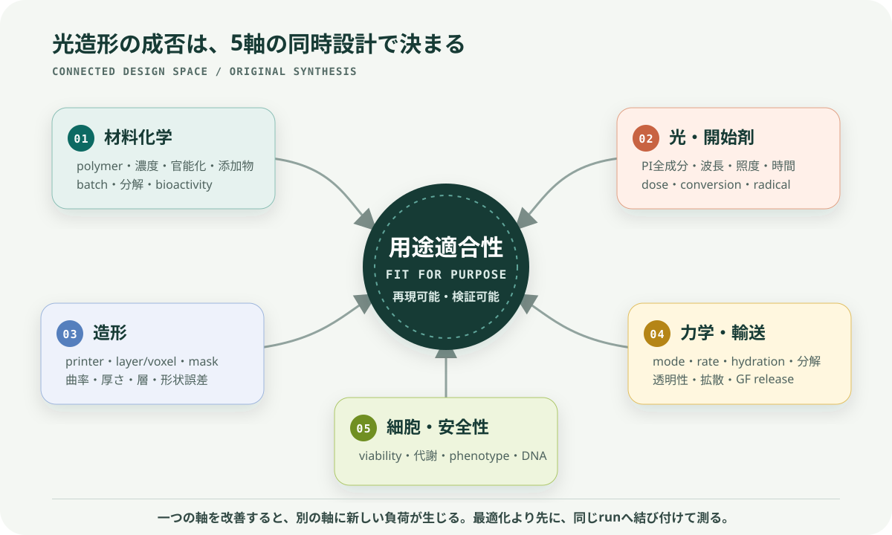
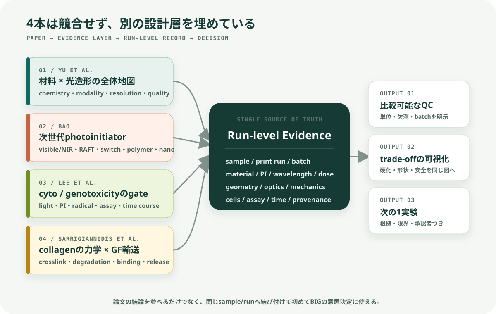
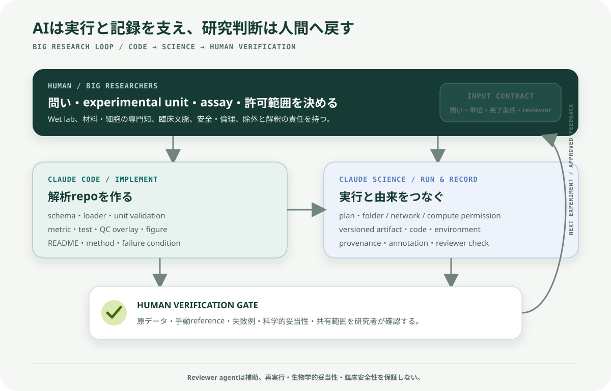

# 光重合性バイオマテリアルと光造形

## 4論文レビューと、Claude Code × Claude ScienceによるBIGへの貢献案

> **結論:** 4本を統合すると、光造形バイオマテリアルの成功は「材料を硬くする」ことではなく、**材料化学、光・開始剤、造形精度、力学・輸送、細胞安全性**を同時に設計し、その関係を追跡可能なデータとして残すことにある。BIGに対して最も現実的に貢献できるのは、新しい材料や臨床判断をAIへ任せることではなく、実験条件・画像・測定値・解析コードをつなぐ**再現可能なEvidence & QC基盤**を小さく作ることである。

この文書の [論文] は論文本文に基づく要約、[統合] は4本を横断した解釈、[提案] はBIGで議論するための案を示す。4本はいずれもレビュー論文であり、新しい単一実験の報告ではない。したがって、論文間の数値を条件差を無視して直接比較してはならない。



*図1. 4論文を横断して抽出した5つの連結軸。オリジナル図解。*

## 1. まず押さえる5点

1. **材料とプリンターは独立ではない。** 同じハイドロゲルでも、官能基、開始剤、波長、照度、露光時間、吸収・散乱で硬化深さと形状精度が変わる。[1]
2. **長波長化は有望だが、安全性の証明ではない。** 可視光〜NIRはUVの直接リスクを減らし、深達性を高める可能性がある一方、高機能な多成分開始系の残留物・共開始剤の生体適合性評価は不足している。[2]
3. **LIVE/DEADだけでは不十分である。** 生き残った細胞にもDNA損傷が残り得るため、代謝、経時的生存、DNA損傷を分けて評価する必要がある。[3]
4. **コラーゲンの強みと弱みは表裏一体である。** ECMに近く生体適合性が高い一方、そのままでは弱く、分解が速く、成長因子を特異的に保持しにくい。補強や架橋は、細胞応答・透明性・輸送・分解も同時に変える。[4]
5. **BIGで価値になるのは、条件→構造→機能→安全性の接続である。** 角膜用途では特に、曲率、厚さ、層の連続性、透明性、力学、細胞生存を同じsample・print run・bioink batchへ結び付ける必要がある。[5][6]

## 2. 4本の位置づけ

| 論文 | 主な問い | 本レビューでの役割 | BIGへの接点 |
| --- | --- | --- | --- |
| Yu et al., *Chemical Reviews* (2020) [1] | どの材料化学と光造形法を、どう組み合わせるか | システム全体の地図 | bioink・光学・造形条件を共同設計する枠組み |
| Bao, *Macromolecular Rapid Communications* (2022) [2] | 次世代photoinitiatorは何を可能にするか | 開始剤設計の最前線 | 可視光化、高速化、深部硬化、機能化の候補と安全性ギャップ |
| Lee et al., *STEM CELLS Translational Medicine* (2020) [3] | 光架橋で生じる細胞毒性・遺伝毒性をどう検出するか | 安全性ゲート | viabilityだけに依存しない評価設計と標準化 |
| Sarrigiannidis et al., *Materials Today Bio* (2021) [4] | コラーゲンをどう補強し、成長因子を保持・放出するか | 力学・輸送・生物活性の設計 | collagen bioinkの補強、分解、GF提示、透明性・取扱性のtrade-off |

### 2.1 重要フレーズ早見表

以下は逐語引用ではなく、各論文の中心的な主張を日本語で短く言い換えたものである。

| 論文 | 重要フレーズ | 何を意味するか |
| --- | --- | --- |
| Yu et al. | **材料と光造形法は一つのsystemとして選ぶ** | polymer、官能基、PI、波長、dose、opticsを別々に最適化しない |
| Yu et al. | **doseは比較の入口で、硬化度や安全性そのものではない** | 同じJ/cm²でも吸収、散乱、酸素、厚さ、kineticsで結果が変わる |
| Bao | **photoinitiatorは触媒以上の設計要素である** | 波長、速度、解像度、post-functionalisation、multimaterial化を左右する |
| Bao | **長波長化は安全性の証明ではない** | donor、acceptor、nanoparticle、未反応物まで評価する必要がある |
| Lee et al. | **高いviabilityはDNA損傷がないことを保証しない** | LIVE/DEAD、代謝、phenotype、必要時のgenotoxicityを分けて測る |
| Lee et al. | **光・PI・radical・工程全体を同じrunで評価する** | 一つの要因だけを毒性源として断定しない |
| Sarrigiannidis et al. | **collagenの補強は輸送と細胞応答も変える** | stiffnessだけでなくmesh、透明性、分解、GF releaseを同時に見る |
| Sarrigiannidis et al. | **growth factorは高濃度化より局所提示の質が重要** | burst、保持率、bioactivity、経時releaseを評価する |

### 2.2 ローカルPDF

4本の公開full textを公式repositoryまたはPubMed Centralから保存した。ファイル、頁数、公式入手元は [PDF索引](../../references/papers/photopolymer-biomaterials/README.md) にまとめている。

- [Yu et al. PDF](../../references/papers/photopolymer-biomaterials/01-yu-2020-photopolymerizable-biomaterials-light-based-3d-printing.pdf)
- [Bao PDF](../../references/papers/photopolymer-biomaterials/02-bao-2022-advanced-photoinitiators-vat-photopolymerization.pdf)
- [Lee et al. PDF](../../references/papers/photopolymer-biomaterials/03-lee-2020-cartilage-photo-crosslinking-cytotoxicity-genotoxicity.pdf)
- [Sarrigiannidis et al. PDF](../../references/papers/photopolymer-biomaterials/04-sarrigiannidis-2021-collagen-hydrogel-modifications.pdf)

## 3. 論文別の本文要約

### 3.1 Yu et al. — Photopolymerizable Biomaterials and Light-Based 3D Printing Strategies for Biomedical Applications

**書誌:** Claire Yu et al., *Chemical Reviews* 120(19), 10695–10743 (2020), DOI: [10.1021/acs.chemrev.9b00810](https://doi.org/10.1021/acs.chemrev.9b00810). [全文リポジトリ](https://escholarship.org/uc/item/1mr0m4jt) [1]

#### 目的と主張

[論文] 光造形の発展に対し、使用できるバイオマテリアルが長くボトルネックだったという問題意識から、光重合反応、材料群、印刷方式、品質制御を一つの設計問題として整理した包括的レビューである。中心的な主張は、**材料組成と造形方式の相互依存を理解しなければ、印刷可能性・生体適合性・機械特性・形状精度を同時に満たせない**という点にある。

#### 本文の要点

- **重合機構:** 主流のfree-radical chain-growthは開始・成長・停止で進み、酸素、阻害剤、radical diffusionの影響を受ける。thiol–eneなどのstep-growthは、より均一なnetwork、低い収縮応力、酸素阻害への比較的高い耐性を得られる場合がある。
- **空間制御:** photoinhibitor、photoabsorber、photolabile基を利用すると、不要な硬化の抑制、硬化深さの制御、印刷後の局所分解・物性変更が可能になる。
- **天然材料:** GelMA、collagen、HA誘導体、alginateなどは細胞接着や分解性に優れる一方、batch差、弱い力学、加工条件への敏感さを持つ。
- **合成材料:** PEG系やPGS系などは分子量・架橋密度・分解を調整しやすい一方、天然ECMのような細胞認識性は自動的には持たない。
- **複合材料:** nanoparticle、natural–synthetic hybrid、interpenetrating networkを使い、単一材料で両立しにくい力学・導電性・bioactivity・印刷性を補う。
- **造形方式:** laser-based SLAは点・線を走査し、DLPは面を一括露光する。volumetric方式はlayer-by-layerの速度・表面品質の制約を越える可能性がある。
- **品質を決める変数:** PI感度、critical exposure、penetration depth、露光dose、post-cure、回折、収差、吸収、散乱、radicalの分子拡散が、横・縦方向の解像度と物性を変える。
- **将来像:** 材料ごとの手作業のtrial-and-errorを減らすため、画像・印刷結果を用いたmachine learningによるmask補正や条件最適化が有望とされる。

#### 読み取るべき限界

[統合] 範囲が広いレビューであり、各材料の優劣を同一条件で直接比較したものではない。また2020年時点の技術地図であり、後発の高度なvisible/NIR開始系や臨床安全性を網羅しない。ここから得るべきものは「万能材料の答え」ではなく、**入力条件と出力品質を結ぶ設計変数の一覧**である。

#### BIGへの意味

[提案] BIGのbioinkやconstructを評価するとき、material nameだけを記録しても不十分である。少なくとも、組成、官能化度、PI、波長、照度、時間、dose、層厚、設計形状、透明性、力学、細胞条件を一つのrunとして結ぶ必要がある。

---

### 3.2 Bao — Recent Trends in Advanced Photoinitiators for Vat Photopolymerization 3D Printing

**書誌:** Yinyin Bao, *Macromolecular Rapid Communications* 43(14), 2200202 (2022), DOI: [10.1002/marc.202200202](https://doi.org/10.1002/marc.202200202). [ETH Zürich全文](https://www.research-collection.ethz.ch/handle/20.500.11850/551481) [2]

> **引用時の注意:** Wileyには同じ題名のfrontispiece（article number 2270042、DOI `10.1002/marc.202270042`）もある。本文レビューの正しいarticle numberは **2200202**、DOIは **10.1002/marc.202200202** である。

#### 目的と主張

[論文] SLA/DLPにおけるphotoinitiatorを、単なる硬化スイッチではなく、波長、速度、解像度、後加工、multimaterial化、volumetric化を決める機能要素として扱い、直近の5つの研究潮流を整理している。

#### 5つの潮流

1. **405 nmを越えるvisible〜NIR開始系:** Eosin Y、Ru系、BODIPY、porphyrinなどにより、green/red/NIRでの硬化を狙う。低いphoton energyと深い光侵入はbiomedicineに有利になり得る。
2. **photo-RAFT:** 成長鎖を可逆的に制御し、印刷後の表面機能化、self-healing、network制御を可能にする。ただし単独では速度・解像度が不足し、TPO等を併用する例がある。
3. **photoswitch:** 波長で開始・阻害を切り替え、一液からのmultimaterial造形やvolumetric printingを可能にする。
4. **polymeric/macrophotoinitiator:** 低分子PIの水溶性・compatibility・migrationの課題を軽減し、開始効率や架橋密度も高め得る。
5. **nanoassembly/upconversion:** hydrophobic PIの水分散化、nanophotoinitiatorによる高効率化、NIRを内部でUV/blueへ変換する深部・非侵襲的硬化を狙う。

#### 重要なtrade-off

- 長波長化はUV曝露を避ける可能性を持つが、**多成分系のdonor、acceptor、触媒、nanoparticle残留物まで安全とは限らない**。
- RAFTは機能化に強いが、oxygen/water感受性、速度、解像度、network–property関係の比較が未成熟である。
- photoswitchで扱える材料群はまだ狭く、biodegradable polymerへの展開が必要である。
- upconversionは深達性を得る一方、高い光強度・粒子濃度、合成scale、解像度が課題になる。
- 著者は、green〜NIR開始系の候補選定にmachine learningを用いる可能性を示す一方、**多成分開始系のbiocompatibility評価がほとんど不足している**と明記している。

#### BIGへの意味

[提案] 「長波長だから安全」「短時間だから低毒性」と単純化せず、PI本体だけでなく全成分、吸収波長、実測dose、未反応残留物、洗浄・培養後の時間変化まで記録する必要がある。新規PI探索にMLを使う前に、比較可能なschemaと欠測の可視化を作ることが先である。

---

### 3.3 Lee et al. — Human articular cartilage repair: Sources and detection of cytotoxicity and genotoxicity in photo-crosslinkable hydrogel bioscaffolds

**書誌:** Cheuk Lee et al., *STEM CELLS Translational Medicine* 9(3), 302–315 (2020), DOI: [10.1002/sctm.19-0192](https://doi.org/10.1002/sctm.19-0192). [PMC全文](https://pmc.ncbi.nlm.nih.gov/articles/PMC7031631/) [3]

#### 目的と主張

[論文] 関節軟骨修復用のcell-laden photo-crosslinkable hydrogelを臨床へ移す際、細胞死だけでなくDNA損傷をどう特定・測定・低減するかを検討する。最大の警告は、**高い短期viabilityは、腫瘍化につながり得るDNA lesionがないことを意味しない**という点である。

#### 毒性の主な発生源

- **光:** UV-Bは直接的なDNA photoproduct、UV-Aは主にROSを介した酸化損傷を生じ得る。波長だけでなく強度と時間が重要である。
- **PI分子:** hydrophobicityが高いPIは細胞膜へ入りやすく、intrinsic toxicityが高くなる場合がある。必要濃度はPI効率・材料・官能化度・cell typeで変わる。
- **活性種:** PI活性化で生じるfree radicalとROSが、細胞機能とDNAを傷つけ得る。論文はこれを主要因とみなす。
- **工程全体:** extrusion shear、酸素・栄養拡散、室温での長いfabrication、CO₂管理などもviabilityを変えるため、光架橋だけを孤立して評価してはならない。

#### 評価方法

- **生死と空間:** LIVE/DEADは3D内の位置を見られるが、死んでいない細胞の機能・DNA損傷を保証しない。
- **代謝:** MTT、WST、resazurin等は多検体を定量しやすいが、3D空間情報を失う。LIVE/DEADとの併用が望ましい。
- **DNA損傷:** p53BP1、γH2AX、comet assayが候補になる。ただし抗体のgel内penetration、background、細胞抽出時の二次損傷など、3D scaffold向けprotocol標準化が不足している。
- **時間軸:** 直後だけでなく、数日後の代謝低下・細胞数・機能を追う必要がある。

#### 低減策

- PIの種類・濃度、波長、照度、時間、材料のdegree of functionalizationを共同最適化する。
- LAP、VA-086、Eosin Y、Ru/SPSなどの候補は条件により利点があるが、どれも全条件で安全という結論ではない。
- visible lightは直接的UVリスクを減らせる可能性があるが、適切なPIとdose検証が必要である。
- coaxial extrusionでcell-containing coreとPI-containing shellを分け、細胞をradicalから空間的に保護する方法が示されている。

#### BIGへの意味と移植上の注意

[統合] この論文はcartilageを対象とするため、閾値やcell susceptibilityをcorneal cellsへそのまま移せない。一方、**viability・metabolism・genotoxicityを分離し、光・PI・材料・工程を同じrunで記録する安全設計原則**は、cell-laden corneal constructにも検討価値がある。実際のassay採否はBIGの研究者、安全・倫理手順、対象細胞に従う。

---

### 3.4 Sarrigiannidis et al. — A tough act to follow: collagen hydrogel modifications to improve mechanical and growth factor loading capabilities

**書誌:** Stylianos O. Sarrigiannidis et al., *Materials Today Bio* 10, 100098 (2021), DOI: [10.1016/j.mtbio.2021.100098](https://doi.org/10.1016/j.mtbio.2021.100098). [PMC全文](https://pmc.ncbi.nlm.nih.gov/articles/PMC7973388/) [4]

#### 目的と主張

[論文] Type I collagen hydrogelはECMとの近さ、低免疫原性、細胞接着、分解性に優れるが、単独では弱く、収縮・分解が速く、growth factor（GF）特異的結合部位も乏しい。本論文は、**力学補強とGFの局所提示・持続放出を同時に考える必要性**を整理している。

#### 力学特性を変える方法

- **物理的fibrillogenesis:** collagen濃度、由来、pH、温度、塩、重合時間でfibril径、pore、gelation、透明性、粘弾性が変わる。
- **配向:** flow、strain、磁場等によるfiber alignmentは異方性とcell orientationを制御し、神経、筋、血管、角膜のような方向性を持つ組織に重要である。
- **UV／dehydrothermal treatment:** 追加試薬を減らせるが、collagen構造・細胞への光損傷と、得られる物性を同時に見る必要がある。riboflavinを用いる光架橋も含む。
- **化学架橋:** glutaraldehyde、isocyanate、carbodiimide、multifunctional PEG、glycation、genipin等は強度・分解を変えられるが、残留毒性、反応速度、架橋均一性、bioactivity低下など固有の制約がある。
- **酵素架橋:** transglutaminase等は比較的mildな条件を使える一方、酵素安定性、速度、得られる強度が制約になり得る。

論文は、shear、compression、tensionで得る「stiffness」は同じ量ではなく、collagenがnon-linear viscoelasticであるため、strain、time scale、hydration、degradation条件を揃えずに値を比較できないと注意する。

#### GFを保持・提示する方法

- **直接混合:** 最も単純だが、mesh size、swelling、degradationに依存し、初期burst releaseを生じやすい。
- **共有結合:** GFをcollagenへ固定し放出を抑えられるが、反応部位によってはGFを変性・失活させる。
- **electrostatic／specific binding:** heparin、heparan sulfate、HA等のGAG、fibronectin由来domain、collagen-binding domainを利用し、低濃度で局所提示する。
- **microcarrier／microgel:** GFを別の粒子相へ封入し、拡散距離・分解・粒径でreleaseを調整する。
- **細胞応答型:** cell tractionでpayloadを放出するTrAPのように、局所の細胞行動をtriggerにする高度な方式もある。

#### 結論と限界

[論文] 力学とGF deliveryはそれぞれ進歩したが、両方を同じsystemで評価する研究は少ない。複数cell・複数GF、burstの抑制、持続的な生理濃度、scale-up、shelf life、surgeonが扱える操作性が未解決である。また、市販例では生理濃度を大きく超えるGF loadingが副作用につながり得るため、**高濃度化ではなく局所提示の質**が重要とされる。

#### BIGへの意味

[提案] collagen bioinkを「印刷できた／硬くなった」だけで評価せず、fibril・層・透明性、変形モード別の力学、分解、輸送、cell phenotypeを結び付ける。GFを扱う場合は、総投入量だけでなく、保持率、初期burst、経時release、bioactivityを同じ設計表へ含める。

## 4. 4本を統合した設計原理



*図2. 各論文の役割をrun-level evidenceへ統合する関係。オリジナル図解。*

### 4.1 5軸を一つのrunとして扱う

| 連結軸 | 最低限残す入力 | 代表的な失敗 | 見るべき出力 |
| --- | --- | --- | --- |
| 材料化学 | polymer、由来、濃度、官能基、DoF、添加物、batch | batch差、弱いgel、bioactivity低下 | gelation、swelling、degradation、chemistry確認 |
| 光・開始剤 | PI全成分、濃度、波長、照度、時間、geometry | 未硬化、overcure、残留毒性、radical damage | dose、conversion、cure depth、残留・洗浄条件 |
| 造形 | printer、pixel/voxel、layer、mask、温度、build time | scattering、異方的解像度、形状誤差 | 寸法誤差、surface、層連続性、再現性 |
| 力学・輸送 | 試験mode、strain、rate、hydration、培地、時点 | stiffnessの誤比較、拡散不足、burst release | shear/compression/tension、透明性、release曲線 |
| 細胞・安全 | cell type、density、passage、PI接触、assay、時点 | 短期viabilityだけで安全と判断 | LIVE/DEAD、代謝、phenotype、必要時DNA damage |

光doseの基本計算は `dose (J/cm²) = irradiance (mW/cm²) × time (s) / 1000` である。ただし、**同じdoseでも同じ結果にはならない**。波長とPI吸収、光路、厚さ、散乱、oxygen、反応kineticsが異なるため、doseは比較の入口であって安全性・硬化度の代替指標ではない。

### 4.2 中心となるtrade-off

```text
架橋を増やす
  ├─ 形状保持・強度・硬化安定性は上がり得る
  └─ radical exposure・収縮・脆化・拡散低下・細胞負荷も増え得る

長波長化する
  ├─ 低photon energy・深いpenetrationを得られる可能性
  └─ 多成分PI・高濃度粒子・残留物という新しい安全変数が増える

collagenを補強する
  ├─ load-bearing・取扱性・分解制御が改善し得る
  └─ fibril、透明性、ligand、GF release、cell responseも変わる
```

[統合] したがって「最大stiffness」「最速硬化」「最高viability」の単一目的ではなく、用途ごとに**許容範囲を満たすPareto型の多目的設計**として扱うべきである。ただしsample数が少ない段階で複雑なML最適化を始めず、まず単位・欠測・実験単位・batchを正す。

### 4.3 4本が共通して残すEvidence gap

- 報告項目と単位が揃わず、PI・光・材料・cell typeを横断比較しにくい。
- 高度な開始系の印刷性能に比べ、全成分の長期biocompatibility・genotoxicityデータが少ない。
- 短期viability、力学、透明性、GF releaseが別々の研究として評価され、同じconstructに統合されにくい。
- 3D内の空間差と時間変化が、平均値だけで失われる。
- 臨床translationに必要なscale、shelf life、operator差、再現性、データ由来が不足する。

## 5. BIGとの具体的な接点

University of SydneyのBIGは、human tissue bioengineering、biomaterial production、drug delivery devices、AIによるdisease detection/monitoring/drug discoveryを公式領域としている。[5] また、BIG研究者による2026年のdual-layer corneal constructは、Col-I／Col-IV、曲率、透明性、層構造、細胞生存を同時に扱っている。[6]

4本からBIGへ引ける線は次のとおりである。

| BIGの課題 | 4本から得る設計視点 | 計算・可視化で支援できること |
| --- | --- | --- |
| collagen bioink | 架橋、fibril、透明性、分解、cell responseの連動 | batch/run registry、物性比較、条件別trace plot |
| curved / multilayer construct | optics・scattering・layer fidelity・material interaction | 曲率、厚さ、層連続性、設計との差の3D/画像QC |
| cell-laden fabrication | PI、radical、光、工程によるcyto/genotoxicity | assay schema、時点別spatial map、QC flag |
| drug / GF delivery | mesh・degradation・binding・burst release | release curve、model fit、条件とbioactivityの対応 |
| translation | 再現性、scale、operator、provenance | versioned pipeline、固定report、監査可能なartifact |

ここで、cartilage論文の具体的な細胞・閾値をcorneaへ転用することは提案していない。転用するのは、**安全性を分解して記録・検証する方法論**である。

## 6. Claude Code × Claude Scienceでどう貢献するか

本書では、依頼文の「クラウドコードサイエンス」を、**Claude CodeとClaude Scienceを連携させる研究ワークフロー**として扱う。「Claude Code Science」という単一の正式製品名ではない。

- **Claude Code:** schema、loader、unit validation、解析、test、figure、READMEをコードrepoとして実装する。
- **Claude Science:** 承認したfolder・計算環境でplanを実行し、文献・データ・code・figure・reportをversioned artifactとprovenanceへつなぐ。[7][8]
- **研究者:** 問い、実験単位、除外、assay、科学的妥当性、安全性、公開範囲を決め、結果を原データで検証する。



*図3. 実装・実行記録・研究者検証を分離したBIG向けワークフロー。オリジナル図解。*

### 6.1 優先順位つき貢献案

| 優先 | 貢献案 | 具体的な成果物 | なぜ今できるか |
| --- | --- | --- | --- |
| P0 | **Photocrosslinking Evidence Registry** | data dictionary、CSV/Parquet schema、source link、missingness report | 4論文が示す比較不能問題を直接減らす |
| P0 | **Dose & Unit QC** | dose calculator、波長・照度・時間・単位check、test suite | 小規模でも検証でき、転記ミスを早く発見できる |
| P1 | **Corneal Construct Image/3D QC** | 曲率・厚さ・層連続性・design deviationのoverlayとreport | BIGの曲面・多層construct評価へ直接つながる |
| P1 | **Multi-objective Decision View** | cure depth、透明性、力学、viability等の条件別plot | 単一指標の最適化を避け、trade-offを会議で共有できる |
| P2 | **Reusable Analysis Skill** | 承認済みpipeline、環境、method card、artifact template | 検証後の手順を次のrunへ再利用できる |

### 6.2 Evidence Registryの推奨項目

```yaml
identity:
  sample_id: required
  print_run_id: required
  bioink_batch_id: required
  operator_id: controlled
material:
  polymer: [collagen_I, collagen_IV, GelMA, HA, PEGDA, other]
  source: required
  concentration: value + unit
  degree_of_functionalization: value + method
  additives: full composition
photochemistry:
  initiator_system: all components
  concentration: each component + unit
  wavelength_nm: required
  irradiance_mW_cm2: required
  exposure_s: required
  dose_J_cm2: derived, never manually trusted
printing:
  printer_and_optics: required
  layer_or_voxel: value + unit
  temperature_C: required
  design_file_version: required
outcomes:
  geometry: curvature, thickness, layer continuity, deviation
  optics: transmittance or approved proxy + wavelength range
  mechanics: mode, strain/rate, hydration, timepoint
  biology: cell type, passage, density, assay, timepoint
  safety: viability, metabolism, phenotype, approved DNA-damage assay
provenance:
  raw_path: immutable reference
  method_version: required
  code_commit: required
  reviewer: required
```

## 7. 推奨する最初の4週間pilot

### Photocrosslinking Evidence & QC Pilot

**問い:** 承認済みの公開文献または既存BIGデータから、光架橋条件と、形状・透明性・力学・細胞のうち利用可能な1〜2出力を、同じrun単位で再現可能に結び付けられるか。

**前提:** BIGで現在photo-crosslinkingを使っているか、どのデータを利用できるかは未確認である。内部データが使えない場合は、4論文と承認済み公開資料だけでregistryのprototypeを作る。

| 週 | 作業 | 完了条件 |
| --- | --- | --- |
| Week 1 — SCOPE | 研究者と問い、experimental unit、必須field、データ区分、primary metricを固定 | 1ページcharter、data dictionary、除外ルールが承認済み |
| Week 2 — BUILD | loader、schema、dose/unit validation、欠測report、synthetic test dataを実装 | rawを変更せず、既知入力でtestが通り、誤単位を失敗させる |
| Week 3 — MEASURE | 利用可能な1指標を解析し、QC overlay／trace plotを生成 | 手動referenceまたは既知寸法との誤差を報告し、失敗例を残す |
| Week 4 — VERIFY | 研究者review、方法・限界・再実行手順、次の1実験案をまとめる | code、figure、report、provenanceが一つのversioned artifactとして再生成可能 |

### 成功基準

- 全sampleが `sample → run → batch → method version → output` まで追跡できる。
- 必須値の欠測は埋めず、明示的にflagされる。
- doseと単位は自動計算・検証され、元値を保持する。
- 少なくとも1つのfigureがraw／processed dataとcodeから再生成できる。
- AIの出力を研究者が原データと照合し、言えること／言えないことを承認する。
- 「性能が上がった」と主張することではなく、**次の比較を正しく行える状態**を作る。

## 8. 安全・ガバナンス境界

- 未公開データ、患者情報、PHI、倫理・共同研究上制限された情報を、承認なく外部AI、個人cloud、公開Gitへ送らない。
- raw dataはread-onlyとし、processed、code、reportを分離する。
- Claude Scienceがlocalでcodeを実行しても、各stepでmodelへ送られるcontextと組織規約を確認する。local executionは「データが一切外へ出ない」という意味ではない。[8]
- Reviewerは実行記録と主張の不一致を減らす補助であり、解析の再実行、assayの妥当性、臨床安全性を保証しない。[8]
- PI選択、cell exclusion、DNA assay、臨床・毒性の判断は、指導研究者と承認済みprotocolへ戻す。
- 文献にない値をAIで補完しない。欠測、推定、論文記載、ラボ実測を別fieldにする。

## 9. 面談で先に確認する6問

1. 現在のBIG projectで、photo-crosslinkingまたはlight-based printingを実際に使っているか。
2. 最初の4週間で使えるのは、公開文献、metadata、画像、3D scan、mechanical data、assay dataのどれか。
3. sample、construct、print run、bioink batchのどれを独立なexperimental unitとするか。
4. 現在最も困っている比較は、shape、transparency、mechanics、viability、releaseのどれか。
5. PI、dose、cell、genotoxicityを含む安全評価は、どのSOP・担当者・倫理条件に従うか。
6. Claude Code／Claude Scienceへ入力可能なデータ区分、保存場所、ログ、reviewer、公開範囲は何か。

## 10. 参考文献・公式情報

1. Yu C, Schimelman J, Wang P, et al. [Photopolymerizable Biomaterials and Light-Based 3D Printing Strategies for Biomedical Applications](https://doi.org/10.1021/acs.chemrev.9b00810). *Chemical Reviews*. 2020;120(19):10695–10743. [Full text](https://escholarship.org/uc/item/1mr0m4jt).
2. Bao Y. [Recent Trends in Advanced Photoinitiators for Vat Photopolymerization 3D Printing](https://doi.org/10.1002/marc.202200202). *Macromolecular Rapid Communications*. 2022;43(14):2200202. [CC BY full text](https://www.research-collection.ethz.ch/handle/20.500.11850/551481).
3. Lee C, O'Connell CD, Onofrillo C, Choong PFM, Di Bella C, Duchi S. [Human articular cartilage repair: Sources and detection of cytotoxicity and genotoxicity in photo-crosslinkable hydrogel bioscaffolds](https://doi.org/10.1002/sctm.19-0192). *STEM CELLS Translational Medicine*. 2020;9(3):302–315. [Full text](https://pmc.ncbi.nlm.nih.gov/articles/PMC7031631/).
4. Sarrigiannidis SO, Rey JM, Dobre O, González-García C, Dalby MJ, Salmeron-Sanchez M. [A tough act to follow: collagen hydrogel modifications to improve mechanical and growth factor loading capabilities](https://doi.org/10.1016/j.mtbio.2021.100098). *Materials Today Bio*. 2021;10:100098. [CC BY full text](https://pmc.ncbi.nlm.nih.gov/articles/PMC7973388/).
5. The University of Sydney. [Biomedical Innovation Group](https://www.sydney.edu.au/medicine-health/our-research/research-centres/biomedical-innovation-group.html). 研究領域・team・collaboration。2026-07-16確認。
6. Huang H, Yuan Y, Fang Y, et al. [A New Bioprinted Dual-Layered Corneal Structure Using Collagen-Based Bioinks](https://doi.org/10.1177/19373341261424272). *Tissue Engineering Part A*. 2026. BIGとの接点を示す補助資料で、指定4論文には含まれない。
7. Anthropic. [Claude Code documentation](https://docs.anthropic.com/en/docs/claude-code/overview). 2026-07-16確認。
8. Anthropic. [Claude Science — Overview](https://claude.com/docs/claude-science/overview). sandbox、artifact、provenance、permissions、reviewerと限界。2026-07-16確認。

## 11. 作成方法と限界

- 指定4論文はabstractだけでなく、公開full textを2026-07-16に確認して要約した。
- これはnarrative synthesisであり、systematic review、meta-analysis、臨床・毒性評価、承認済み研究計画ではない。
- BIGへの接続は公開情報とローカルの既存BIG資料に基づくdiscussion draftである。現在の優先project、SOP、利用可能データは面談で確認する。
- HTML版の図は論文図を転載せず、本文の関係を説明するために作成したオリジナル図解である。

---

**HTML版:** [photopolymer-biomaterials-review.html](../../website/pages/photopolymer-biomaterials-review.html)  
**親ポータル:** [BiG Lab Working Guide](../../website/pages/index.html)
